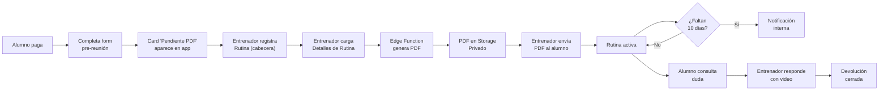
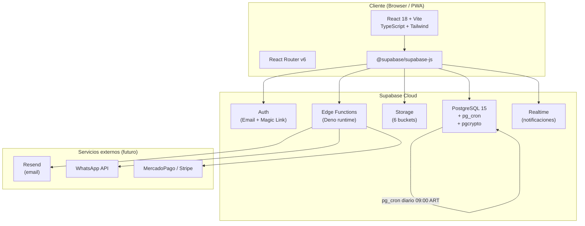
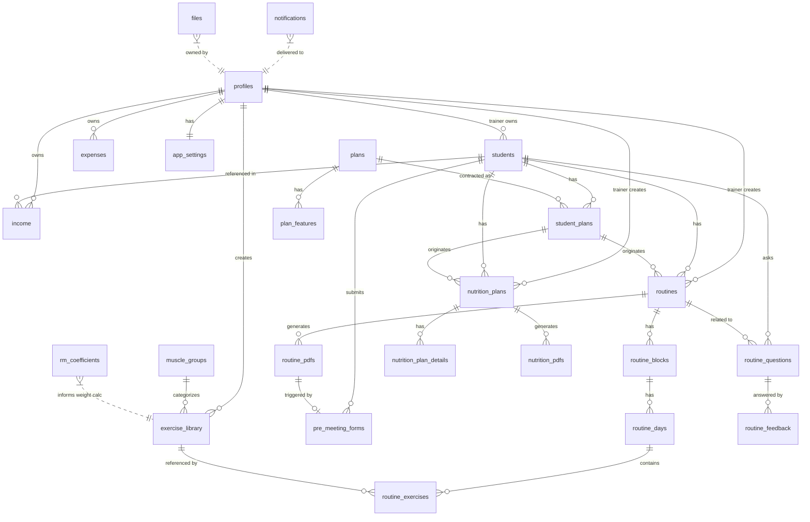
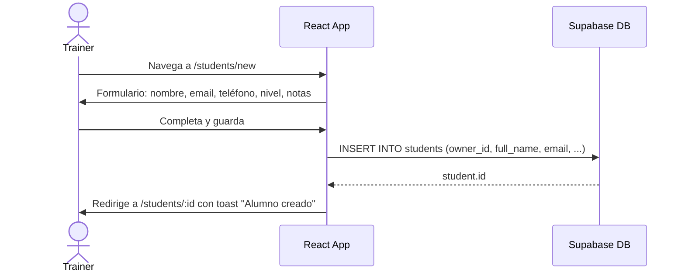
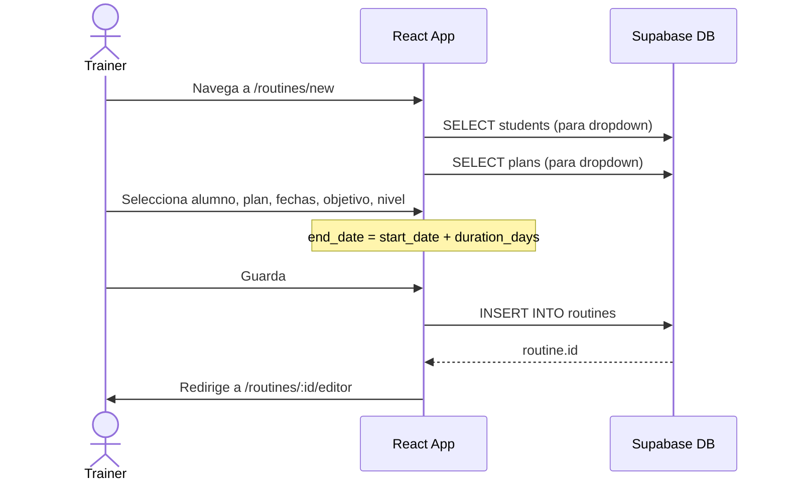
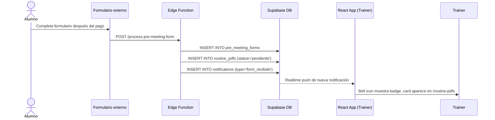
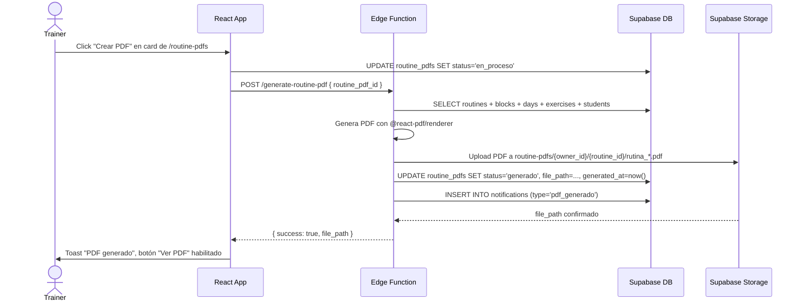
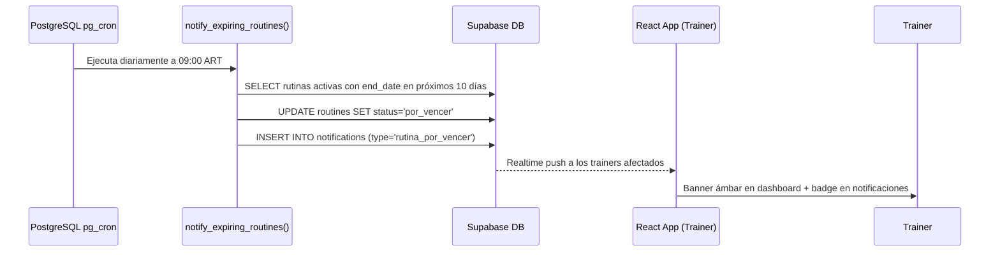
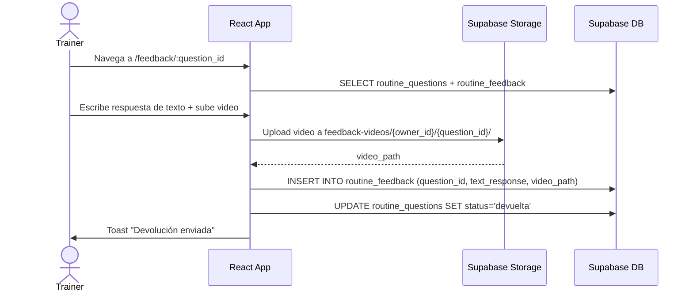
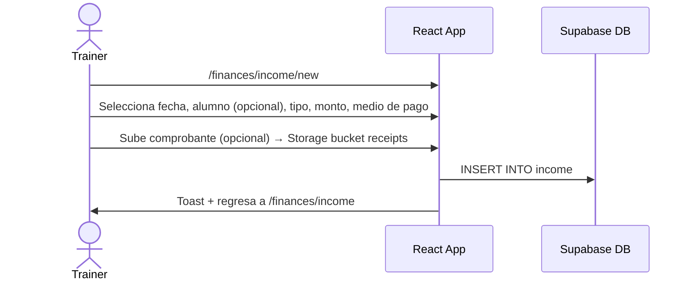

# Haciéndolo Hábito — Arquitectura Full-Stack

> **Stack**: React + Vite + TypeScript + Tailwind CSS + Supabase (Postgres · Auth · Storage · Edge Functions · pg_cron)
> **Fecha**: Abril 2026 | **Versión**: 1.0

---

## Tabla de contenidos

- [A. Resumen ejecutivo](#a-resumen-ejecutivo)
- [B. Análisis de referencias visuales](#b-análisis-de-referencias-visuales)
- [C. Arquitectura técnica](#c-arquitectura-técnica)
- [D. Modelo de base de datos](#d-modelo-de-base-de-datos)
- [E. Diagrama lógico de relaciones](#e-diagrama-lógico-de-relaciones)
- [F. SQL inicial](#f-sql-inicial)
- [G. Row Level Security](#g-row-level-security)
- [H. Estructura de Storage](#h-estructura-de-storage)
- [I. Rutas y pantallas](#i-rutas-y-pantallas)
- [J. Componentes reutilizables](#j-componentes-reutilizables)
- [K. Flujos principales](#k-flujos-principales)
- [L. Edge Functions y automatizaciones](#l-edge-functions-y-automatizaciones)
- [M. Templates PDF](#m-templates-pdf)
- [N. Estados del sistema](#n-estados-del-sistema)
- [O. Roadmap de implementación](#o-roadmap-de-implementación)
- [P. Recomendación de MVP](#p-recomendación-de-mvp)
- [Q. Riesgos y decisiones técnicas](#q-riesgos-y-decisiones-técnicas)
- [R. Preguntas pendientes](#r-preguntas-pendientes)
- [S. Entregable final / TL;DR](#s-entregable-final--tldr)

---

## A. Resumen ejecutivo

**Haciéndolo Hábito** es la plataforma web del entrenador personal Ferster, que migra del sistema AppSheet actual a una SPA React con Supabase como backend. El sistema centraliza la gestión de alumnos, rutinas de entrenamiento, planes alimentarios básicos, devoluciones con video, generación de PDFs automáticos y control de finanzas personales.

### Flujo principal del negocio



### Dos perfiles, un solo backend

| Perfil | Estado en MVP |
|--------|--------------|
| **Entrenador** | Activo — todos los módulos |
| **Nutricionista** | Stand-by — estructura de DB preparada, UI deshabilitada vía feature flag |

### Módulos del Perfil Entrenador (prioridad)

1. Registrar Rutina
2. Registrar Detalles de Rutina
3. Enviar Rutina PDF
4. Enviar Devolución Rutina PDF
5. Registrar Plan Alimentario (básico)
6. Registrar Detalles de Plan Alimentario
7. Enviar PDF Plan Alimentario
8. Registrar Nuevos Ejercicios
9. Registrar Nuevo Gasto
10. Registrar Nuevo Ingreso

---

## B. Análisis de referencias visuales

### Paleta detectada en AppSheet actual

| Elemento | Color AppSheet | Color nuevo propuesto |
|----------|---------------|----------------------|
| Header/Navbar | `#E85D04` (naranja saturado) | `#1E1E1E` con acento `#FF8C00` |
| Fondo general | `#1A1A1A` | `#121212` |
| Cards | `#212121` | `#1E1E1E` |
| Sidebar activo | `#FF8C00` | `#FF8C00` |
| Texto principal | `#FFFFFF` | `#F5F5F5` |
| Texto secundario | `#9E9E9E` | `#A3A3A3` |
| Bordes | `#333333` | `#2A2A2A` |
| Estado activo | `#FF8C00` | `#FF8C00` |
| Estado inactivo | `#555555` | `#3A3A3A` con texto `#A3A3A3` |

### Mapeo pantalla AppSheet → nueva pantalla React

| Pantalla AppSheet | Ruta React nueva | Observaciones |
|------------------|-----------------|---------------|
| Menu (Alumnos/Rutinas/Finanzas/Nutrición) | `/dashboard` | Dashboard con 4 stat-cards + accesos directos |
| Registrar Rutina | `/routines/new` | Formulario con validación y feedback en tiempo real |
| Registrar Detalles de Rutina | `/routines/:id/editor` | Editor visual multi-día con drag & drop de ejercicios |
| Enviar rutina PDF | `/routine-pdfs` | Cards con estado y acciones rápidas |
| Enviar Devolución rutina PDF | `/feedback` | Cards por alumno con historial colapsable |
| Registrar Plan Alimentario | `/nutrition/new` | Formulario (gated cuando nutrición esté activa) |
| Registrar Detalles de Plan | `/nutrition/:id/editor` | Similar al editor de rutina |
| Enviar PDF Plan Alimentario | `/nutrition-pdfs` | Misma lógica que routine-pdfs |
| Registrar Nuevos Ejercicios | `/exercises/new` | Formulario + upload de video/imagen |
| Registrar un nuevo Gasto | `/finances/expenses/new` | Formulario simple con categorías |
| Registrar un nuevo Ingreso | `/finances/income/new` | Formulario con vinculación a alumno |

### Qué copiar del diseño AppSheet

- **Cards agrupadas por estado** (Activo / Inactivo): patrón de agrupación claro, fácil de escanear.
- **Acciones rápidas en la card**: "Crear PDF", "Ficha del Alumno" — reducen clics innecesarios.
- **Sidebar persistente** con ítem activo destacado en naranja.
- **Jerarquía tipográfica** en cards: Plan (pequeño arriba) → Nombre alumno (grande) → Meta/fechas (pequeño abajo).
- **Sección "Activo" primero**, "Inactivo" segundo — correcto orden de relevancia.

### Qué evitar y mejorar

| Problema en AppSheet | Solución en React |
|---------------------|-------------------|
| Formularios verticales infinitos sin agrupación | Agrupar campos en secciones con título (`FormSection`) |
| Sin feedback visual al guardar (spinner/toast) | Toast de confirmación + estado del botón "Guardando…" |
| Sin búsqueda en pantallas de lista | SearchBar en header de cada lista |
| Sin paginación — todo carga junto | Paginación o infinite scroll con Supabase `.range()` |
| Sidebar oculta en mobile | Bottom navigation en `< lg`, sidebar en `>= lg` |
| Sin empty state en listas vacías | Componente `EmptyState` con CTA |
| Cards sin indicador de urgencia visual | Badge `"Vence en N días"` con color ámbar/rojo |

### Tokens de diseño — Tailwind extension

```typescript
// tailwind.config.ts
colors: {
  brand: {
    primary:    '#FF8C00',   // botones principales, íconos activos
    hover:      '#FFB347',   // hover, gradientes cálidos
    warm:       '#F3D8C7',   // texto destacado cálido, labels
  },
  surface: {
    base:       '#121212',   // fondo general
    card:       '#1E1E1E',   // cards, sidebar, header
    elevated:   '#252525',   // modales, tooltips
    input:      '#1E1E1E',   // inputs
    border:     '#2A2A2A',   // bordes
    inputBorder:'#3A2A1A',   // borde naranja opaco en inputs
  },
  ink: {
    primary:    '#F5F5F5',   // texto principal
    secondary:  '#A3A3A3',   // texto secundario
    warm:       '#F3D8C7',   // texto cálido destacado
    muted:      '#6B6B6B',   // texto muy suave, placeholders
  },
  status: {
    active:     '#FF8C00',   // activo
    expiring:   '#F59E0B',   // por vencer (ámbar)
    expired:    '#EF4444',   // vencido (rojo suave)
    paused:     '#6B6B6B',   // pausado
    generated:  '#22C55E',   // PDF generado (verde)
    sent:       '#3B82F6',   // enviado (azul)
    error:      '#F87171',   // error (rosa)
  }
}
```

---

## C. Arquitectura técnica

### Diagrama de capas



### Variables de entorno

```bash
# Frontend (.env.local)
VITE_SUPABASE_URL=https://xxxx.supabase.co
VITE_SUPABASE_ANON_KEY=eyJhbGc...
VITE_APP_ENV=development              # 'development' | 'production'
VITE_FEATURE_NUTRITION=false          # Feature flag: módulo nutrición

# Backend (Supabase secrets, via supabase secrets set)
SUPABASE_SERVICE_ROLE_KEY=eyJhbGc...
RESEND_API_KEY=re_xxxx                # Email (Fase 2+)
WHATSAPP_API_KEY=                     # WhatsApp (Fase 4+)
PDF_WATERMARK_DISABLED=true           # Para PDFs sin marca de agua en dev
```

### Deploy

| Servicio | Plataforma | Notas |
|---------|-----------|-------|
| Frontend | Vercel (Free tier) | CI automático desde GitHub main |
| Backend | Supabase Cloud (Free → Pro) | Pro cuando se necesite pg_cron en prod |
| Edge Functions | Supabase Edge Runtime (Deno) | Deploy con `supabase functions deploy` |
| CDN / Assets estáticos | Vercel Edge Network | Automático |

### Estructura de carpetas del proyecto

```
app/
├── src/
│   ├── components/          # Componentes reutilizables
│   │   ├── ui/              # Primitivos: Button, Input, Badge, Card
│   │   ├── layout/          # AppLayout, Sidebar, MobileNav, Header
│   │   └── domain/          # StudentCard, RoutineEditor, PDFPreviewCard...
│   ├── pages/               # Una carpeta por ruta principal
│   │   ├── auth/
│   │   ├── dashboard/
│   │   ├── students/
│   │   ├── routines/
│   │   ├── routine-pdfs/
│   │   ├── feedback/
│   │   ├── exercises/
│   │   ├── nutrition/       # Gated por feature flag
│   │   └── finances/
│   ├── hooks/               # useStudents, useRoutine, useAuth...
│   ├── lib/
│   │   ├── supabase.ts      # Cliente Supabase
│   │   ├── constants.ts
│   │   └── utils.ts
│   ├── types/               # Tipos generados de Supabase + tipos de dominio
│   └── stores/              # Zustand: auth, notifications
├── supabase/
│   ├── migrations/
│   │   └── 0001_init.sql
│   └── functions/
│       ├── generate-routine-pdf/
│       ├── generate-nutrition-pdf/
│       ├── notify-expiring-routines/
│       └── ...
├── public/
│   ├── manifest.json        # PWA manifest
│   └── icons/
├── tailwind.config.ts
├── vite.config.ts
└── package.json
```

---

## D. Modelo de base de datos

### Decisiones de diseño globales

1. Todos los IDs son `uuid DEFAULT gen_random_uuid()`.
2. Todas las tablas tienen `created_at timestamptz DEFAULT now()` y `updated_at timestamptz DEFAULT now()` con trigger automático.
3. Los estados usan `enum` PostgreSQL (nunca `varchar` libre).
4. Cada tabla operativa tiene `owner_id uuid REFERENCES auth.users(id)` para multi-tenancy futuro.
5. Los campos de texto libre usan `text`, no `varchar(n)`.
6. Montos en `numeric(12,2)` para evitar errores de punto flotante.

---

### Grupo 1: Identidad

#### `profiles`
> Extiende `auth.users`. Se crea automáticamente por trigger al registrar usuario.

| Campo | Tipo | Notas |
|-------|------|-------|
| `id` | `uuid PK` | = `auth.users.id` |
| `full_name` | `text NOT NULL` | |
| `avatar_url` | `text` | Path en bucket `profile-images` |
| `role` | `app_role NOT NULL DEFAULT 'trainer'` | Enum |
| `phone` | `text` | |
| `bio` | `text` | |
| `created_at` | `timestamptz` | |
| `updated_at` | `timestamptz` | |

**Enum `app_role`**: `admin`, `trainer`, `nutritionist`, `student`

---

#### `students`
> Ficha de cada alumno gestionado por el entrenador.

| Campo | Tipo | Notas |
|-------|------|-------|
| `id` | `uuid PK` | |
| `owner_id` | `uuid NOT NULL → auth.users` | Entrenador dueño del alumno |
| `profile_id` | `uuid → auth.users` | NULL hasta Fase 7 (cuando alumno tenga login) |
| `full_name` | `text NOT NULL` | |
| `email` | `text` | |
| `phone` | `text` | |
| `birth_date` | `date` | |
| `level` | `student_level NOT NULL` | Enum: `inicial`, `intermedio`, `avanzado` |
| `gender` | `text` | `M`, `F`, `otro` |
| `status` | `student_status NOT NULL DEFAULT 'activo'` | Enum |
| `notes` | `text` | Observaciones generales |
| `created_at` | `timestamptz` | |
| `updated_at` | `timestamptz` | |

**Índices**: `idx_students_owner_id`, `idx_students_email`

---

### Grupo 2: Catálogo de planes y ejercicios

#### `plans`
> Los planes comerciales del entrenador (Gorila Bronce, Gorila Oro, Hábitos Platino, Hábitos Progresión, etc.)

| Campo | Tipo | Notas |
|-------|------|-------|
| `id` | `uuid PK` | |
| `owner_id` | `uuid NOT NULL → auth.users` | |
| `name` | `text NOT NULL` | Ej: "Gorila Bronce", "Hábitos Platino" |
| `description` | `text` | |
| `type` | `plan_type NOT NULL` | Enum: `entrenamiento`, `nutricion`, `combo` |
| `duration_days` | `int NOT NULL` | Duración estándar del plan en días |
| `price` | `numeric(12,2)` | Precio base |
| `is_active` | `bool NOT NULL DEFAULT true` | |
| `created_at` | `timestamptz` | |
| `updated_at` | `timestamptz` | |

#### `plan_features`
> Características o entregables de cada plan (bullets comerciales).

| Campo | Tipo | Notas |
|-------|------|-------|
| `id` | `uuid PK` | |
| `plan_id` | `uuid NOT NULL → plans` | |
| `feature` | `text NOT NULL` | Ej: "Rutina personalizada", "1 corrección/semana" |
| `sort_order` | `int NOT NULL DEFAULT 0` | |

---

#### `muscle_groups`
> Catálogo de grupos musculares. Seed inicial desde el Excel.

| Campo | Tipo | Notas |
|-------|------|-------|
| `id` | `uuid PK` | |
| `name` | `text NOT NULL UNIQUE` | Ej: "PECHO", "ESPALDA" |
| `slug` | `text NOT NULL UNIQUE` | Ej: "pecho", "espalda" |
| `sort_order` | `int NOT NULL DEFAULT 0` | |

**Seed inicial** (extraído del Diccionario de Ejercicios):
`MULTIARTICULARES`, `PECHO`, `ESPALDA`, `HOMBROS`, `BICEPS`, `TRICEPS`, `ABDOMEN`, `CUADRICEPS`, `ADUCTORES`, `ISQUIOTIBIALES`, `GLÚTEOS`, `GEMELOS`, `OTROS`

---

#### `exercise_library`
> Biblioteca de ejercicios del entrenador. Seed desde hoja "DICCIONARIO DE EJERCICIOS".

| Campo | Tipo | Notas |
|-------|------|-------|
| `id` | `uuid PK` | |
| `owner_id` | `uuid NOT NULL → auth.users` | NULL para ejercicios del sistema |
| `muscle_group_id` | `uuid NOT NULL → muscle_groups` | Grupo muscular primario |
| `name` | `text NOT NULL` | Ej: "Press banca" |
| `slug` | `text NOT NULL` | Para búsquedas |
| `description` | `text` | Descripción técnica |
| `common_errors` | `text` | Errores frecuentes |
| `equipment` | `text[]` | Array: ["barra", "banco"] |
| `difficulty` | `exercise_difficulty` | Enum: `basico`, `intermedio`, `avanzado` |
| `video_url` | `text` | URL externa o path en Storage |
| `image_url` | `text` | Path en bucket `exercise-media` |
| `is_system` | `bool NOT NULL DEFAULT false` | true = seed del sistema, no editable por trainer |
| `is_active` | `bool NOT NULL DEFAULT true` | |
| `created_at` | `timestamptz` | |
| `updated_at` | `timestamptz` | |

**Índices**: `idx_exercise_library_muscle_group_id`, `idx_exercise_library_name_gin` (full-text search)

---

#### `rm_coefficients`
> Tabla de porcentajes de carga según repeticiones (Epley modificado, extraída del Excel hoja RM).

| Campo | Tipo | Notas |
|-------|------|-------|
| `reps` | `int PK` | Número de repeticiones (1-15) |
| `coefficient` | `numeric(6,4) NOT NULL` | Factor multiplicador (ej: 0.9722) |
| `percentage_label` | `text NOT NULL` | Label para UI (ej: "95% (+/-2)") |
| `intensity_zone` | `text` | Ej: "Fuerza máxima", "Hipertrofia" |

---

### Grupo 3: Operación de rutinas

#### `student_plans`
> Registro de qué plan contrató cada alumno (historial de contratos).

| Campo | Tipo | Notas |
|-------|------|-------|
| `id` | `uuid PK` | |
| `owner_id` | `uuid NOT NULL → auth.users` | |
| `student_id` | `uuid NOT NULL → students` | |
| `plan_id` | `uuid NOT NULL → plans` | |
| `price_paid` | `numeric(12,2)` | Precio real cobrado (puede diferir del base) |
| `payment_status` | `payment_status NOT NULL DEFAULT 'pendiente'` | Enum |
| `start_date` | `date NOT NULL` | |
| `end_date` | `date NOT NULL` | Calculado: start_date + plan.duration_days |
| `notes` | `text` | |
| `created_at` | `timestamptz` | |

---

#### `routines`
> Cabecera de la rutina de un alumno para un periodo determinado.

| Campo | Tipo | Notas |
|-------|------|-------|
| `id` | `uuid PK` | |
| `owner_id` | `uuid NOT NULL → auth.users` | |
| `student_id` | `uuid NOT NULL → students` | |
| `student_plan_id` | `uuid → student_plans` | Plan asociado (optional si se registra sin plan) |
| `name` | `text NOT NULL` | Nombre de la rutina (ej: "Gorila Bronce - Semana 1") |
| `objective` | `text NOT NULL` | Objetivo del coach |
| `level` | `student_level NOT NULL` | Copia del nivel al momento del registro |
| `start_date` | `date NOT NULL` | |
| `end_date` | `date NOT NULL` | Calculado: start_date + duration_days |
| `duration_days` | `int NOT NULL` | |
| `price` | `numeric(12,2)` | |
| `status` | `routine_status NOT NULL DEFAULT 'activa'` | Enum |
| `notes` | `text` | Aclaraciones importantes |
| `last_status_change` | `timestamptz` | |
| `created_at` | `timestamptz` | |
| `updated_at` | `timestamptz` | |

**Índices**: `idx_routines_student_id`, `idx_routines_status`, `idx_routines_end_date`

**Enum `routine_status`**: `activa`, `por_vencer`, `vencida`, `pausada`, `cancelada`

> **Regla**: Un trigger o la Edge Function `notify-expiring-routines` actualiza `status` a `por_vencer` cuando `end_date - now() <= 10 days`.

---

#### `routine_blocks`
> Bloque temporal de una rutina (Semana 1, Semana 2, Mesociclo A, etc.)

| Campo | Tipo | Notas |
|-------|------|-------|
| `id` | `uuid PK` | |
| `routine_id` | `uuid NOT NULL → routines` | |
| `name` | `text NOT NULL` | Ej: "Semana 1", "Bloque A" |
| `sort_order` | `int NOT NULL DEFAULT 0` | |
| `notes` | `text` | |

---

#### `routine_days`
> Día de entrenamiento dentro de un bloque.

| Campo | Tipo | Notas |
|-------|------|-------|
| `id` | `uuid PK` | |
| `block_id` | `uuid NOT NULL → routine_blocks` | |
| `day_name` | `text NOT NULL` | Ej: "Lunes", "Día 1", "Push" |
| `day_of_week` | `int` | 1=Lunes…7=Domingo (null si es "Día N") |
| `muscle_focus` | `text` | Ej: "Pecho + Tríceps" |
| `sort_order` | `int NOT NULL DEFAULT 0` | |
| `warmup_notes` | `text` | Entrada en calor |

---

#### `routine_exercises`
> Ejercicio individual dentro de un día de entrenamiento.

| Campo | Tipo | Notas |
|-------|------|-------|
| `id` | `uuid PK` | |
| `day_id` | `uuid NOT NULL → routine_days` | |
| `exercise_id` | `uuid NOT NULL → exercise_library` | |
| `sort_order` | `int NOT NULL DEFAULT 0` | Orden del ejercicio |
| `sets` | `int` | Número de series |
| `reps_min` | `int` | Reps mínimas (ej: 8) |
| `reps_max` | `int` | Reps máximas (ej: 12) → "8-12 reps" |
| `weight_kg` | `numeric(6,2)` | Peso sugerido |
| `rir` | `int` | Reps In Reserve (0-4) |
| `rpe` | `numeric(4,1)` | Rating of Perceived Exertion (1-10) |
| `rest_seconds` | `int` | Descanso en segundos |
| `tempo` | `text` | Ej: "3-1-2-0" |
| `video_url` | `text` | Link a video de referencia |
| `technical_notes` | `text` | Notas técnicas del entrenador |
| `is_superset` | `bool NOT NULL DEFAULT false` | |
| `superset_group` | `int` | Para agrupar ejercicios en superset |

---

### Grupo 4: Formulario pre-reunión y PDFs

#### `pre_meeting_forms`
> Formulario que completa el alumno después del pago y antes de la reunión con el entrenador. Dispara la creación de la card en "Enviar Rutina PDF".

| Campo | Tipo | Notas |
|-------|------|-------|
| `id` | `uuid PK` | |
| `owner_id` | `uuid NOT NULL → auth.users` | Entrenador al que llega |
| `student_id` | `uuid → students` | Puede ser null si no tiene login todavía |
| `student_name` | `text NOT NULL` | Para casos sin cuenta |
| `student_email` | `text` | |
| `student_phone` | `text` | |
| `objective` | `text NOT NULL` | Objetivo declarado por el alumno |
| `pathologies` | `text` | Patologías o info importante |
| `training_days_available` | `int` | Días disponibles para entrenar |
| `training_time_minutes` | `int` | Tiempo disponible por sesión |
| `previous_training_days` | `int` | Días que entrenaba antes |
| `gym_equipment` | `text` | Descripción del equipamiento disponible |
| `sleep_hours` | `numeric(3,1)` | Horas de sueño habituales |
| `supplements` | `text` | Suplementos que consume |
| `meals_per_day` | `int` | Comidas diarias |
| `plan_id` | `uuid → plans` | Plan que contrató |
| `status` | `form_status NOT NULL DEFAULT 'recibido'` | Enum |
| `submitted_at` | `timestamptz NOT NULL DEFAULT now()` | |
| `processed_at` | `timestamptz` | Cuando el trainer la revisó |

**Enum `form_status`**: `recibido`, `revisado`, `en_proceso`

---

#### `routine_pdfs`
> Registro de cada PDF de rutina generado o pendiente de generar.

| Campo | Tipo | Notas |
|-------|------|-------|
| `id` | `uuid PK` | |
| `owner_id` | `uuid NOT NULL → auth.users` | |
| `routine_id` | `uuid NOT NULL → routines` | |
| `student_id` | `uuid NOT NULL → students` | Desnormalizado para queries rápidas |
| `form_id` | `uuid → pre_meeting_forms` | Form que originó este PDF |
| `status` | `pdf_status NOT NULL DEFAULT 'pendiente'` | Enum |
| `file_path` | `text` | Path en bucket `routine-pdfs` |
| `file_size_kb` | `int` | |
| `generated_at` | `timestamptz` | |
| `sent_at` | `timestamptz` | |
| `sent_via` | `text` | Ej: "email", "whatsapp", "manual" |
| `error_message` | `text` | En caso de error en generación |
| `created_at` | `timestamptz` | |
| `updated_at` | `timestamptz` | |

**Enum `pdf_status`**: `pendiente`, `en_proceso`, `generado`, `enviado`, `error`

---

### Grupo 5: Devoluciones

#### `routine_questions`
> Consulta/duda del alumno sobre su rutina.

| Campo | Tipo | Notas |
|-------|------|-------|
| `id` | `uuid PK` | |
| `owner_id` | `uuid NOT NULL → auth.users` | |
| `student_id` | `uuid NOT NULL → students` | |
| `routine_id` | `uuid → routines` | |
| `exercise_id` | `uuid → exercise_library` | Si la duda es sobre un ejercicio específico |
| `title` | `text NOT NULL` | Título corto de la consulta |
| `description` | `text NOT NULL` | Descripción detallada |
| `media_url` | `text` | Video o foto del alumno (en Storage) |
| `status` | `question_status NOT NULL DEFAULT 'recibida'` | Enum |
| `received_at` | `timestamptz NOT NULL DEFAULT now()` | |
| `closed_at` | `timestamptz` | |

**Enum `question_status`**: `recibida`, `en_revision`, `devuelta`, `cerrada`

---

#### `routine_feedback`
> Devolución del entrenador a una consulta.

| Campo | Tipo | Notas |
|-------|------|-------|
| `id` | `uuid PK` | |
| `owner_id` | `uuid NOT NULL → auth.users` | |
| `question_id` | `uuid NOT NULL → routine_questions` | |
| `text_response` | `text` | Texto de la respuesta |
| `video_path` | `text` | Path en bucket `feedback-videos` |
| `video_url_external` | `text` | URL de YouTube / Drive (alternativa a Storage) |
| `pdf_path` | `text` | PDF adjunto si aplica |
| `responded_at` | `timestamptz NOT NULL DEFAULT now()` | |

---

### Grupo 6: Nutrición (stand-by, estructura lista)

#### `nutrition_plans`
> Guía nutricional básica del entrenador (no plan clínico del nutricionista).

| Campo | Tipo | Notas |
|-------|------|-------|
| `id` | `uuid PK` | |
| `owner_id` | `uuid NOT NULL → auth.users` | |
| `student_id` | `uuid NOT NULL → students` | |
| `student_plan_id` | `uuid → student_plans` | |
| `name` | `text NOT NULL` | |
| `objective` | `nutrition_objective NOT NULL` | Enum |
| `start_date` | `date NOT NULL` | |
| `end_date` | `date NOT NULL` | |
| `duration_days` | `int NOT NULL` | |
| `price` | `numeric(12,2)` | |
| `status` | `routine_status NOT NULL DEFAULT 'activa'` | Reutiliza mismo enum |
| `total_calories` | `int` | |
| `protein_g` | `numeric(6,1)` | |
| `carbs_g` | `numeric(6,1)` | |
| `fat_g` | `numeric(6,1)` | |
| `hydration_notes` | `text` | |
| `general_notes` | `text` | |
| `foods_to_avoid` | `text` | |
| `is_trainer_guide` | `bool NOT NULL DEFAULT true` | true=guía básica trainer, false=plan nutricionista formal |
| `created_at` | `timestamptz` | |
| `updated_at` | `timestamptz` | |

**Enum `nutrition_objective`**: `bajar_grasa`, `ganar_masa`, `mantenimiento`, `recomposicion`, `definicion`, `pre_competencia`, `post_competencia`

---

#### `nutrition_plan_details`
> Ítems individuales del plan alimentario.

| Campo | Tipo | Notas |
|-------|------|-------|
| `id` | `uuid PK` | |
| `nutrition_plan_id` | `uuid NOT NULL → nutrition_plans` | |
| `meal_number` | `int NOT NULL` | 1=Desayuno, 2=Almuerzo, etc. |
| `meal_name` | `text NOT NULL` | Ej: "Desayuno", "Post-entreno" |
| `option_variant` | `int NOT NULL DEFAULT 1` | Para ofrecer variantes (Opción A / B) |
| `food_category` | `text NOT NULL` | Ej: "Proteínas", "Carbohidratos" |
| `food_name` | `text NOT NULL` | |
| `quantity_grams` | `numeric(7,2)` | |
| `unit` | `text NOT NULL DEFAULT 'gr'` | "gr", "ml", "unidad", "cdas" |
| `alternatives` | `text` | Alternativas sugeridas |
| `notes` | `text` | |
| `sort_order` | `int NOT NULL DEFAULT 0` | |

---

#### `nutrition_pdfs`
> Misma estructura que `routine_pdfs` pero para nutrición.

| Campo | Tipo | Notas |
|-------|------|-------|
| `id` | `uuid PK` | |
| `owner_id` | `uuid NOT NULL → auth.users` | |
| `nutrition_plan_id` | `uuid NOT NULL → nutrition_plans` | |
| `student_id` | `uuid NOT NULL → students` | |
| `status` | `pdf_status NOT NULL DEFAULT 'pendiente'` | |
| `file_path` | `text` | |
| `generated_at` | `timestamptz` | |
| `sent_at` | `timestamptz` | |
| `error_message` | `text` | |
| `created_at` | `timestamptz` | |
| `updated_at` | `timestamptz` | |

---

### Grupo 7: Finanzas

#### `expenses`
> Gastos personales del entrenador.

| Campo | Tipo | Notas |
|-------|------|-------|
| `id` | `uuid PK` | |
| `owner_id` | `uuid NOT NULL → auth.users` | |
| `expense_date` | `date NOT NULL` | |
| `category` | `text NOT NULL` | Ej: "Marketing", "Equipamiento" |
| `subcategory` | `text` | |
| `description` | `text NOT NULL` | |
| `amount` | `numeric(12,2) NOT NULL` | |
| `expense_type` | `expense_type NOT NULL` | Enum: `fijo`, `variable` |
| `payment_method` | `payment_method NOT NULL` | Enum: `efectivo_debito`, `tarjeta_credito`, `transferencia` |
| `receipt_path` | `text` | Path en bucket `receipts` |
| `notes` | `text` | |
| `created_at` | `timestamptz` | |
| `updated_at` | `timestamptz` | |

**Enum `expense_type`**: `fijo`, `variable`
**Enum `payment_method`**: `efectivo_debito`, `tarjeta_credito`, `transferencia`, `otro`

---

#### `income`
> Ingresos del entrenador.

| Campo | Tipo | Notas |
|-------|------|-------|
| `id` | `uuid PK` | |
| `owner_id` | `uuid NOT NULL → auth.users` | |
| `income_date` | `date NOT NULL` | |
| `student_id` | `uuid → students` | Opcional |
| `student_plan_id` | `uuid → student_plans` | Opcional |
| `income_type` | `text NOT NULL` | Ej: "Plan entrenamiento", "Consulta suelta" |
| `category` | `text NOT NULL` | |
| `description` | `text NOT NULL` | |
| `amount` | `numeric(12,2) NOT NULL` | |
| `payment_method` | `payment_method NOT NULL` | |
| `status` | `income_status NOT NULL DEFAULT 'cobrado'` | Enum |
| `receipt_path` | `text` | Path en bucket `receipts` |
| `notes` | `text` | |
| `created_at` | `timestamptz` | |
| `updated_at` | `timestamptz` | |

**Enum `income_status`**: `pendiente`, `cobrado`, `cancelado`

---

### Grupo 8: Sistema

#### `notifications`
> Notificaciones internas (alertas de vencimiento, nuevos forms, etc.)

| Campo | Tipo | Notas |
|-------|------|-------|
| `id` | `uuid PK` | |
| `user_id` | `uuid NOT NULL → auth.users` | Destinatario |
| `type` | `notification_type NOT NULL` | Enum |
| `title` | `text NOT NULL` | |
| `body` | `text NOT NULL` | |
| `linked_table` | `text` | Ej: "routines" |
| `linked_id` | `uuid` | ID del registro relacionado |
| `is_read` | `bool NOT NULL DEFAULT false` | |
| `read_at` | `timestamptz` | |
| `created_at` | `timestamptz` | |

**Enum `notification_type`**: `rutina_por_vencer`, `form_recibido`, `pdf_generado`, `consulta_recibida`, `feedback_enviado`, `pago_pendiente`, `sistema`

---

#### `files`
> Registro centralizado de todos los archivos en Storage.

| Campo | Tipo | Notas |
|-------|------|-------|
| `id` | `uuid PK` | |
| `owner_id` | `uuid NOT NULL → auth.users` | |
| `bucket` | `text NOT NULL` | Nombre del bucket |
| `path` | `text NOT NULL` | Path completo en el bucket |
| `filename` | `text NOT NULL` | Nombre original del archivo |
| `mime_type` | `text NOT NULL` | |
| `size_bytes` | `bigint` | |
| `linked_table` | `text` | Tabla relacionada |
| `linked_id` | `uuid` | ID del registro relacionado |
| `is_public` | `bool NOT NULL DEFAULT false` | |
| `created_at` | `timestamptz` | |

---

#### `app_settings`
> Configuración de la app por usuario.

| Campo | Tipo | Notas |
|-------|------|-------|
| `id` | `uuid PK` | |
| `user_id` | `uuid NOT NULL UNIQUE → auth.users` | |
| `notify_expiring_days` | `int NOT NULL DEFAULT 10` | Días de anticipación para alertas |
| `feature_nutrition` | `bool NOT NULL DEFAULT false` | Feature flag por usuario |
| `pdf_logo_url` | `text` | Logo personalizado en PDFs |
| `pdf_footer_text` | `text` | Texto del pie de PDFs |
| `timezone` | `text NOT NULL DEFAULT 'America/Argentina/Buenos_Aires'` | |
| `updated_at` | `timestamptz` | |

---

#### `audit_logs`
> Log de acciones importantes (opcional, solo para admin).

| Campo | Tipo | Notas |
|-------|------|-------|
| `id` | `uuid PK` | |
| `user_id` | `uuid → auth.users` | |
| `action` | `text NOT NULL` | Ej: "routine.create", "pdf.send" |
| `table_name` | `text` | |
| `record_id` | `uuid` | |
| `old_values` | `jsonb` | Estado anterior |
| `new_values` | `jsonb` | Estado nuevo |
| `ip_address` | `inet` | |
| `created_at` | `timestamptz` | |

---

## E. Diagrama lógico de relaciones



---

## F. SQL inicial

```sql
-- ============================================================
-- HACIÉNDOLO HÁBITO — Migración inicial
-- Supabase / PostgreSQL 15
-- ============================================================

-- Extensiones
CREATE EXTENSION IF NOT EXISTS "pgcrypto";
CREATE EXTENSION IF NOT EXISTS "pg_cron";

-- ============================================================
-- ENUMS
-- ============================================================

CREATE TYPE app_role AS ENUM ('admin', 'trainer', 'nutritionist', 'student');
CREATE TYPE student_level AS ENUM ('inicial', 'intermedio', 'avanzado');
CREATE TYPE student_status AS ENUM ('activo', 'inactivo', 'pausado', 'baja');
CREATE TYPE plan_type AS ENUM ('entrenamiento', 'nutricion', 'combo');
CREATE TYPE routine_status AS ENUM ('activa', 'por_vencer', 'vencida', 'pausada', 'cancelada');
CREATE TYPE pdf_status AS ENUM ('pendiente', 'en_proceso', 'generado', 'enviado', 'error');
CREATE TYPE form_status AS ENUM ('recibido', 'revisado', 'en_proceso');
CREATE TYPE question_status AS ENUM ('recibida', 'en_revision', 'devuelta', 'cerrada');
CREATE TYPE payment_status AS ENUM ('pendiente', 'cobrado', 'cancelado', 'reembolsado');
CREATE TYPE income_status AS ENUM ('pendiente', 'cobrado', 'cancelado');
CREATE TYPE expense_type AS ENUM ('fijo', 'variable');
CREATE TYPE payment_method AS ENUM ('efectivo_debito', 'tarjeta_credito', 'transferencia', 'otro');
CREATE TYPE notification_type AS ENUM (
  'rutina_por_vencer', 'form_recibido', 'pdf_generado',
  'consulta_recibida', 'feedback_enviado', 'pago_pendiente', 'sistema'
);
CREATE TYPE exercise_difficulty AS ENUM ('basico', 'intermedio', 'avanzado');
CREATE TYPE nutrition_objective AS ENUM (
  'bajar_grasa', 'ganar_masa', 'mantenimiento',
  'recomposicion', 'definicion', 'pre_competencia', 'post_competencia'
);

-- ============================================================
-- FUNCIÓN DE UPDATED_AT AUTOMÁTICO
-- ============================================================

CREATE OR REPLACE FUNCTION handle_updated_at()
RETURNS TRIGGER AS $$
BEGIN
  NEW.updated_at = now();
  RETURN NEW;
END;
$$ LANGUAGE plpgsql;

CREATE OR REPLACE FUNCTION set_updated_at(tbl text)
RETURNS void AS $$
BEGIN
  EXECUTE format(
    'CREATE TRIGGER set_updated_at
     BEFORE UPDATE ON %I
     FOR EACH ROW EXECUTE FUNCTION handle_updated_at()',
    tbl
  );
END;
$$ LANGUAGE plpgsql;

-- ============================================================
-- FUNCIÓN HELPER: rol del usuario actual para RLS
-- ============================================================

CREATE OR REPLACE FUNCTION current_app_role()
RETURNS app_role AS $$
  SELECT role FROM public.profiles WHERE id = auth.uid();
$$ LANGUAGE sql STABLE SECURITY DEFINER;

-- ============================================================
-- TABLA: profiles
-- ============================================================

CREATE TABLE public.profiles (
  id          uuid PRIMARY KEY REFERENCES auth.users(id) ON DELETE CASCADE,
  full_name   text NOT NULL,
  avatar_url  text,
  role        app_role NOT NULL DEFAULT 'trainer',
  phone       text,
  bio         text,
  created_at  timestamptz NOT NULL DEFAULT now(),
  updated_at  timestamptz NOT NULL DEFAULT now()
);

SELECT set_updated_at('profiles');

COMMENT ON TABLE public.profiles IS 'Extiende auth.users con datos del perfil de la app';
COMMENT ON COLUMN public.profiles.role IS 'Rol del usuario: admin, trainer, nutritionist, student';

-- Trigger: crear perfil automáticamente al registrar usuario
CREATE OR REPLACE FUNCTION public.handle_new_user()
RETURNS TRIGGER AS $$
BEGIN
  INSERT INTO public.profiles (id, full_name, role)
  VALUES (
    NEW.id,
    COALESCE(NEW.raw_user_meta_data->>'full_name', NEW.email),
    'trainer'
  );
  RETURN NEW;
END;
$$ LANGUAGE plpgsql SECURITY DEFINER;

CREATE TRIGGER on_auth_user_created
  AFTER INSERT ON auth.users
  FOR EACH ROW EXECUTE FUNCTION public.handle_new_user();

-- ============================================================
-- TABLA: students
-- ============================================================

CREATE TABLE public.students (
  id          uuid PRIMARY KEY DEFAULT gen_random_uuid(),
  owner_id    uuid NOT NULL REFERENCES auth.users(id) ON DELETE CASCADE,
  profile_id  uuid REFERENCES auth.users(id) ON DELETE SET NULL,
  full_name   text NOT NULL,
  email       text,
  phone       text,
  birth_date  date,
  level       student_level NOT NULL DEFAULT 'inicial',
  gender      text CHECK (gender IN ('M', 'F', 'otro')),
  status      student_status NOT NULL DEFAULT 'activo',
  notes       text,
  created_at  timestamptz NOT NULL DEFAULT now(),
  updated_at  timestamptz NOT NULL DEFAULT now()
);

SELECT set_updated_at('students');
CREATE INDEX idx_students_owner_id ON public.students(owner_id);
CREATE INDEX idx_students_email ON public.students(email);
CREATE INDEX idx_students_status ON public.students(status);

-- ============================================================
-- TABLA: plans
-- ============================================================

CREATE TABLE public.plans (
  id             uuid PRIMARY KEY DEFAULT gen_random_uuid(),
  owner_id       uuid NOT NULL REFERENCES auth.users(id) ON DELETE CASCADE,
  name           text NOT NULL,
  description    text,
  type           plan_type NOT NULL DEFAULT 'entrenamiento',
  duration_days  int NOT NULL CHECK (duration_days > 0),
  price          numeric(12,2) DEFAULT 0,
  is_active      bool NOT NULL DEFAULT true,
  created_at     timestamptz NOT NULL DEFAULT now(),
  updated_at     timestamptz NOT NULL DEFAULT now()
);

SELECT set_updated_at('plans');

CREATE TABLE public.plan_features (
  id          uuid PRIMARY KEY DEFAULT gen_random_uuid(),
  plan_id     uuid NOT NULL REFERENCES public.plans(id) ON DELETE CASCADE,
  feature     text NOT NULL,
  sort_order  int NOT NULL DEFAULT 0
);

-- ============================================================
-- TABLA: muscle_groups
-- ============================================================

CREATE TABLE public.muscle_groups (
  id          uuid PRIMARY KEY DEFAULT gen_random_uuid(),
  name        text NOT NULL UNIQUE,
  slug        text NOT NULL UNIQUE,
  sort_order  int NOT NULL DEFAULT 0
);

-- ============================================================
-- TABLA: exercise_library
-- ============================================================

CREATE TABLE public.exercise_library (
  id               uuid PRIMARY KEY DEFAULT gen_random_uuid(),
  owner_id         uuid REFERENCES auth.users(id) ON DELETE CASCADE,
  muscle_group_id  uuid NOT NULL REFERENCES public.muscle_groups(id),
  name             text NOT NULL,
  slug             text NOT NULL,
  description      text,
  common_errors    text,
  equipment        text[],
  difficulty       exercise_difficulty NOT NULL DEFAULT 'intermedio',
  video_url        text,
  image_url        text,
  is_system        bool NOT NULL DEFAULT false,
  is_active        bool NOT NULL DEFAULT true,
  created_at       timestamptz NOT NULL DEFAULT now(),
  updated_at       timestamptz NOT NULL DEFAULT now()
);

SELECT set_updated_at('exercise_library');
CREATE INDEX idx_exercise_library_muscle_group ON public.exercise_library(muscle_group_id);
CREATE INDEX idx_exercise_library_owner ON public.exercise_library(owner_id);
CREATE INDEX idx_exercise_library_name ON public.exercise_library USING gin(to_tsvector('spanish', name));

-- ============================================================
-- TABLA: rm_coefficients
-- ============================================================

CREATE TABLE public.rm_coefficients (
  reps              int PRIMARY KEY CHECK (reps BETWEEN 1 AND 20),
  coefficient       numeric(6,4) NOT NULL,
  percentage_label  text NOT NULL,
  intensity_zone    text
);

-- ============================================================
-- TABLA: student_plans
-- ============================================================

CREATE TABLE public.student_plans (
  id              uuid PRIMARY KEY DEFAULT gen_random_uuid(),
  owner_id        uuid NOT NULL REFERENCES auth.users(id) ON DELETE CASCADE,
  student_id      uuid NOT NULL REFERENCES public.students(id) ON DELETE CASCADE,
  plan_id         uuid NOT NULL REFERENCES public.plans(id),
  price_paid      numeric(12,2),
  payment_status  payment_status NOT NULL DEFAULT 'pendiente',
  start_date      date NOT NULL,
  end_date        date NOT NULL,
  notes           text,
  created_at      timestamptz NOT NULL DEFAULT now(),
  CONSTRAINT chk_dates CHECK (end_date >= start_date)
);

CREATE INDEX idx_student_plans_student ON public.student_plans(student_id);
CREATE INDEX idx_student_plans_plan ON public.student_plans(plan_id);

-- ============================================================
-- TABLA: routines
-- ============================================================

CREATE TABLE public.routines (
  id                  uuid PRIMARY KEY DEFAULT gen_random_uuid(),
  owner_id            uuid NOT NULL REFERENCES auth.users(id) ON DELETE CASCADE,
  student_id          uuid NOT NULL REFERENCES public.students(id) ON DELETE CASCADE,
  student_plan_id     uuid REFERENCES public.student_plans(id) ON DELETE SET NULL,
  name                text NOT NULL,
  objective           text NOT NULL,
  level               student_level NOT NULL DEFAULT 'inicial',
  start_date          date NOT NULL,
  end_date            date NOT NULL,
  duration_days       int NOT NULL CHECK (duration_days > 0),
  price               numeric(12,2) DEFAULT 0,
  status              routine_status NOT NULL DEFAULT 'activa',
  notes               text,
  last_status_change  timestamptz,
  created_at          timestamptz NOT NULL DEFAULT now(),
  updated_at          timestamptz NOT NULL DEFAULT now(),
  CONSTRAINT chk_routine_dates CHECK (end_date >= start_date)
);

SELECT set_updated_at('routines');
CREATE INDEX idx_routines_student ON public.routines(student_id);
CREATE INDEX idx_routines_owner ON public.routines(owner_id);
CREATE INDEX idx_routines_status ON public.routines(status);
CREATE INDEX idx_routines_end_date ON public.routines(end_date);

-- ============================================================
-- TABLAS: routine_blocks, routine_days, routine_exercises
-- ============================================================

CREATE TABLE public.routine_blocks (
  id          uuid PRIMARY KEY DEFAULT gen_random_uuid(),
  routine_id  uuid NOT NULL REFERENCES public.routines(id) ON DELETE CASCADE,
  name        text NOT NULL,
  sort_order  int NOT NULL DEFAULT 0,
  notes       text
);

CREATE INDEX idx_routine_blocks_routine ON public.routine_blocks(routine_id);

CREATE TABLE public.routine_days (
  id            uuid PRIMARY KEY DEFAULT gen_random_uuid(),
  block_id      uuid NOT NULL REFERENCES public.routine_blocks(id) ON DELETE CASCADE,
  day_name      text NOT NULL,
  day_of_week   int CHECK (day_of_week BETWEEN 1 AND 7),
  muscle_focus  text,
  warmup_notes  text,
  sort_order    int NOT NULL DEFAULT 0
);

CREATE INDEX idx_routine_days_block ON public.routine_days(block_id);

CREATE TABLE public.routine_exercises (
  id               uuid PRIMARY KEY DEFAULT gen_random_uuid(),
  day_id           uuid NOT NULL REFERENCES public.routine_days(id) ON DELETE CASCADE,
  exercise_id      uuid NOT NULL REFERENCES public.exercise_library(id),
  sort_order       int NOT NULL DEFAULT 0,
  sets             int CHECK (sets BETWEEN 1 AND 20),
  reps_min         int CHECK (reps_min >= 1),
  reps_max         int CHECK (reps_max >= 1),
  weight_kg        numeric(6,2) CHECK (weight_kg >= 0),
  rir              int CHECK (rir BETWEEN 0 AND 10),
  rpe              numeric(4,1) CHECK (rpe BETWEEN 1 AND 10),
  rest_seconds     int CHECK (rest_seconds >= 0),
  tempo            text,
  video_url        text,
  technical_notes  text,
  is_superset      bool NOT NULL DEFAULT false,
  superset_group   int
);

CREATE INDEX idx_routine_exercises_day ON public.routine_exercises(day_id);
CREATE INDEX idx_routine_exercises_exercise ON public.routine_exercises(exercise_id);

-- ============================================================
-- TABLA: pre_meeting_forms
-- ============================================================

CREATE TABLE public.pre_meeting_forms (
  id                       uuid PRIMARY KEY DEFAULT gen_random_uuid(),
  owner_id                 uuid NOT NULL REFERENCES auth.users(id),
  student_id               uuid REFERENCES public.students(id) ON DELETE SET NULL,
  plan_id                  uuid REFERENCES public.plans(id),
  student_name             text NOT NULL,
  student_email            text,
  student_phone            text,
  objective                text NOT NULL,
  pathologies              text,
  training_days_available  int,
  training_time_minutes    int,
  previous_training_days   int,
  gym_equipment            text,
  sleep_hours              numeric(3,1),
  supplements              text,
  meals_per_day            int,
  status                   form_status NOT NULL DEFAULT 'recibido',
  submitted_at             timestamptz NOT NULL DEFAULT now(),
  processed_at             timestamptz
);

CREATE INDEX idx_pre_meeting_forms_owner ON public.pre_meeting_forms(owner_id);
CREATE INDEX idx_pre_meeting_forms_status ON public.pre_meeting_forms(status);

-- ============================================================
-- TABLA: routine_pdfs
-- ============================================================

CREATE TABLE public.routine_pdfs (
  id             uuid PRIMARY KEY DEFAULT gen_random_uuid(),
  owner_id       uuid NOT NULL REFERENCES auth.users(id),
  routine_id     uuid NOT NULL REFERENCES public.routines(id) ON DELETE CASCADE,
  student_id     uuid NOT NULL REFERENCES public.students(id),
  form_id        uuid REFERENCES public.pre_meeting_forms(id) ON DELETE SET NULL,
  status         pdf_status NOT NULL DEFAULT 'pendiente',
  file_path      text,
  file_size_kb   int,
  generated_at   timestamptz,
  sent_at        timestamptz,
  sent_via       text,
  error_message  text,
  created_at     timestamptz NOT NULL DEFAULT now(),
  updated_at     timestamptz NOT NULL DEFAULT now()
);

SELECT set_updated_at('routine_pdfs');
CREATE INDEX idx_routine_pdfs_routine ON public.routine_pdfs(routine_id);
CREATE INDEX idx_routine_pdfs_status ON public.routine_pdfs(status);

-- ============================================================
-- TABLAS: routine_questions, routine_feedback
-- ============================================================

CREATE TABLE public.routine_questions (
  id          uuid PRIMARY KEY DEFAULT gen_random_uuid(),
  owner_id    uuid NOT NULL REFERENCES auth.users(id),
  student_id  uuid NOT NULL REFERENCES public.students(id) ON DELETE CASCADE,
  routine_id  uuid REFERENCES public.routines(id) ON DELETE SET NULL,
  exercise_id uuid REFERENCES public.exercise_library(id) ON DELETE SET NULL,
  title       text NOT NULL,
  description text NOT NULL,
  media_url   text,
  status      question_status NOT NULL DEFAULT 'recibida',
  received_at timestamptz NOT NULL DEFAULT now(),
  closed_at   timestamptz
);

CREATE INDEX idx_questions_student ON public.routine_questions(student_id);
CREATE INDEX idx_questions_status ON public.routine_questions(status);

CREATE TABLE public.routine_feedback (
  id                  uuid PRIMARY KEY DEFAULT gen_random_uuid(),
  owner_id            uuid NOT NULL REFERENCES auth.users(id),
  question_id         uuid NOT NULL REFERENCES public.routine_questions(id) ON DELETE CASCADE,
  text_response       text,
  video_path          text,
  video_url_external  text,
  pdf_path            text,
  responded_at        timestamptz NOT NULL DEFAULT now()
);

-- ============================================================
-- TABLAS: nutrition_plans, nutrition_plan_details, nutrition_pdfs
-- ============================================================

CREATE TABLE public.nutrition_plans (
  id               uuid PRIMARY KEY DEFAULT gen_random_uuid(),
  owner_id         uuid NOT NULL REFERENCES auth.users(id) ON DELETE CASCADE,
  student_id       uuid NOT NULL REFERENCES public.students(id) ON DELETE CASCADE,
  student_plan_id  uuid REFERENCES public.student_plans(id) ON DELETE SET NULL,
  name             text NOT NULL,
  objective        nutrition_objective NOT NULL DEFAULT 'mantenimiento',
  start_date       date NOT NULL,
  end_date         date NOT NULL,
  duration_days    int NOT NULL CHECK (duration_days > 0),
  price            numeric(12,2) DEFAULT 0,
  status           routine_status NOT NULL DEFAULT 'activa',
  total_calories   int,
  protein_g        numeric(6,1),
  carbs_g          numeric(6,1),
  fat_g            numeric(6,1),
  hydration_notes  text,
  general_notes    text,
  foods_to_avoid   text,
  is_trainer_guide bool NOT NULL DEFAULT true,
  created_at       timestamptz NOT NULL DEFAULT now(),
  updated_at       timestamptz NOT NULL DEFAULT now(),
  CONSTRAINT chk_nutrition_dates CHECK (end_date >= start_date)
);

SELECT set_updated_at('nutrition_plans');

CREATE TABLE public.nutrition_plan_details (
  id                  uuid PRIMARY KEY DEFAULT gen_random_uuid(),
  nutrition_plan_id   uuid NOT NULL REFERENCES public.nutrition_plans(id) ON DELETE CASCADE,
  meal_number         int NOT NULL CHECK (meal_number BETWEEN 1 AND 10),
  meal_name           text NOT NULL,
  option_variant      int NOT NULL DEFAULT 1,
  food_category       text NOT NULL,
  food_name           text NOT NULL,
  quantity_grams      numeric(7,2),
  unit                text NOT NULL DEFAULT 'gr',
  alternatives        text,
  notes               text,
  sort_order          int NOT NULL DEFAULT 0
);

CREATE INDEX idx_nutrition_details_plan ON public.nutrition_plan_details(nutrition_plan_id);

CREATE TABLE public.nutrition_pdfs (
  id                 uuid PRIMARY KEY DEFAULT gen_random_uuid(),
  owner_id           uuid NOT NULL REFERENCES auth.users(id),
  nutrition_plan_id  uuid NOT NULL REFERENCES public.nutrition_plans(id) ON DELETE CASCADE,
  student_id         uuid NOT NULL REFERENCES public.students(id),
  status             pdf_status NOT NULL DEFAULT 'pendiente',
  file_path          text,
  generated_at       timestamptz,
  sent_at            timestamptz,
  error_message      text,
  created_at         timestamptz NOT NULL DEFAULT now(),
  updated_at         timestamptz NOT NULL DEFAULT now()
);

SELECT set_updated_at('nutrition_pdfs');

-- ============================================================
-- TABLAS: expenses, income
-- ============================================================

CREATE TABLE public.expenses (
  id              uuid PRIMARY KEY DEFAULT gen_random_uuid(),
  owner_id        uuid NOT NULL REFERENCES auth.users(id) ON DELETE CASCADE,
  expense_date    date NOT NULL,
  category        text NOT NULL,
  subcategory     text,
  description     text NOT NULL,
  amount          numeric(12,2) NOT NULL CHECK (amount >= 0),
  expense_type    expense_type NOT NULL DEFAULT 'variable',
  payment_method  payment_method NOT NULL DEFAULT 'efectivo_debito',
  receipt_path    text,
  notes           text,
  created_at      timestamptz NOT NULL DEFAULT now(),
  updated_at      timestamptz NOT NULL DEFAULT now()
);

SELECT set_updated_at('expenses');
CREATE INDEX idx_expenses_owner ON public.expenses(owner_id);
CREATE INDEX idx_expenses_date ON public.expenses(expense_date);

CREATE TABLE public.income (
  id               uuid PRIMARY KEY DEFAULT gen_random_uuid(),
  owner_id         uuid NOT NULL REFERENCES auth.users(id) ON DELETE CASCADE,
  income_date      date NOT NULL,
  student_id       uuid REFERENCES public.students(id) ON DELETE SET NULL,
  student_plan_id  uuid REFERENCES public.student_plans(id) ON DELETE SET NULL,
  income_type      text NOT NULL,
  category         text NOT NULL,
  description      text NOT NULL,
  amount           numeric(12,2) NOT NULL CHECK (amount >= 0),
  payment_method   payment_method NOT NULL DEFAULT 'efectivo_debito',
  status           income_status NOT NULL DEFAULT 'cobrado',
  receipt_path     text,
  notes            text,
  created_at       timestamptz NOT NULL DEFAULT now(),
  updated_at       timestamptz NOT NULL DEFAULT now()
);

SELECT set_updated_at('income');
CREATE INDEX idx_income_owner ON public.income(owner_id);
CREATE INDEX idx_income_date ON public.income(income_date);

-- ============================================================
-- TABLA: notifications
-- ============================================================

CREATE TABLE public.notifications (
  id            uuid PRIMARY KEY DEFAULT gen_random_uuid(),
  user_id       uuid NOT NULL REFERENCES auth.users(id) ON DELETE CASCADE,
  type          notification_type NOT NULL,
  title         text NOT NULL,
  body          text NOT NULL,
  linked_table  text,
  linked_id     uuid,
  is_read       bool NOT NULL DEFAULT false,
  read_at       timestamptz,
  created_at    timestamptz NOT NULL DEFAULT now()
);

CREATE INDEX idx_notifications_user ON public.notifications(user_id);
CREATE INDEX idx_notifications_unread ON public.notifications(user_id, is_read) WHERE NOT is_read;

-- ============================================================
-- TABLA: files
-- ============================================================

CREATE TABLE public.files (
  id            uuid PRIMARY KEY DEFAULT gen_random_uuid(),
  owner_id      uuid NOT NULL REFERENCES auth.users(id) ON DELETE CASCADE,
  bucket        text NOT NULL,
  path          text NOT NULL,
  filename      text NOT NULL,
  mime_type     text NOT NULL,
  size_bytes    bigint,
  linked_table  text,
  linked_id     uuid,
  is_public     bool NOT NULL DEFAULT false,
  created_at    timestamptz NOT NULL DEFAULT now(),
  CONSTRAINT files_bucket_path UNIQUE (bucket, path)
);

CREATE INDEX idx_files_owner ON public.files(owner_id);
CREATE INDEX idx_files_linked ON public.files(linked_table, linked_id);

-- ============================================================
-- TABLA: app_settings
-- ============================================================

CREATE TABLE public.app_settings (
  id                    uuid PRIMARY KEY DEFAULT gen_random_uuid(),
  user_id               uuid NOT NULL UNIQUE REFERENCES auth.users(id) ON DELETE CASCADE,
  notify_expiring_days  int NOT NULL DEFAULT 10,
  feature_nutrition     bool NOT NULL DEFAULT false,
  pdf_logo_url          text,
  pdf_footer_text       text,
  timezone              text NOT NULL DEFAULT 'America/Argentina/Buenos_Aires',
  updated_at            timestamptz NOT NULL DEFAULT now()
);

-- ============================================================
-- TABLA: audit_logs
-- ============================================================

CREATE TABLE public.audit_logs (
  id          uuid PRIMARY KEY DEFAULT gen_random_uuid(),
  user_id     uuid REFERENCES auth.users(id) ON DELETE SET NULL,
  action      text NOT NULL,
  table_name  text,
  record_id   uuid,
  old_values  jsonb,
  new_values  jsonb,
  ip_address  inet,
  created_at  timestamptz NOT NULL DEFAULT now()
);

CREATE INDEX idx_audit_logs_user ON public.audit_logs(user_id);
CREATE INDEX idx_audit_logs_action ON public.audit_logs(action);

-- ============================================================
-- FUNCIÓN: Notificaciones de rutinas por vencer (ejecutada por pg_cron)
-- ============================================================

CREATE OR REPLACE FUNCTION public.notify_expiring_routines()
RETURNS void AS $$
DECLARE
  r RECORD;
  days_threshold int;
BEGIN
  FOR r IN
    SELECT
      ro.id AS routine_id,
      ro.owner_id,
      ro.student_id,
      s.full_name AS student_name,
      ro.name AS routine_name,
      ro.end_date,
      (ro.end_date - CURRENT_DATE) AS days_left,
      COALESCE(aps.notify_expiring_days, 10) AS threshold
    FROM public.routines ro
    JOIN public.students s ON s.id = ro.student_id
    LEFT JOIN public.app_settings aps ON aps.user_id = ro.owner_id
    WHERE ro.status = 'activa'
      AND ro.end_date BETWEEN CURRENT_DATE AND CURRENT_DATE + INTERVAL '10 days'
      AND NOT EXISTS (
        SELECT 1 FROM public.notifications n
        WHERE n.linked_id = ro.id
          AND n.type = 'rutina_por_vencer'
          AND n.created_at > CURRENT_DATE - INTERVAL '1 day'
      )
  LOOP
    -- Actualizar status de la rutina
    UPDATE public.routines
    SET status = 'por_vencer', last_status_change = now()
    WHERE id = r.routine_id;

    -- Insertar notificación
    INSERT INTO public.notifications (user_id, type, title, body, linked_table, linked_id)
    VALUES (
      r.owner_id,
      'rutina_por_vencer',
      format('Rutina por vencer: %s', r.student_name),
      format('La rutina "%s" de %s vence en %s días (%s)',
        r.routine_name, r.student_name, r.days_left, r.end_date),
      'routines',
      r.routine_id
    );
  END LOOP;
END;
$$ LANGUAGE plpgsql SECURITY DEFINER;

-- Programar ejecución diaria a las 09:00 ART (UTC-3 = 12:00 UTC)
SELECT cron.schedule(
  'notify-expiring-routines',
  '0 12 * * *',
  $$ SELECT public.notify_expiring_routines(); $$
);

-- ============================================================
-- SEEDS: muscle_groups
-- ============================================================

INSERT INTO public.muscle_groups (name, slug, sort_order) VALUES
  ('MULTIARTICULARES', 'multiarticulares', 1),
  ('PECHO',           'pecho',            2),
  ('ESPALDA',         'espalda',          3),
  ('HOMBROS',         'hombros',          4),
  ('BICEPS',          'biceps',           5),
  ('TRICEPS',         'triceps',          6),
  ('ABDOMEN',         'abdomen',          7),
  ('CUADRICEPS',      'cuadriceps',       8),
  ('ADUCTORES',       'aductores',        9),
  ('ISQUIOTIBIALES',  'isquiotibiales',   10),
  ('GLÚTEOS',         'gluteos',          11),
  ('GEMELOS',         'gemelos',          12),
  ('OTROS',           'otros',            13);

-- ============================================================
-- SEEDS: rm_coefficients (extraído de hoja RM del Excel)
-- ============================================================

INSERT INTO public.rm_coefficients (reps, coefficient, percentage_label, intensity_zone) VALUES
  (1,  1.0000, '100%',       'Fuerza máxima 1RM'),
  (2,  0.9722, '95% (+/-2)', 'Fuerza máxima y sub-máxima (1-5 reps)'),
  (3,  0.9444, '90% (+/-3)', 'Fuerza máxima y sub-máxima (1-5 reps)'),
  (4,  0.9166, '86% (+/-4)', 'Fuerza máxima y sub-máxima (1-5 reps)'),
  (5,  0.8888, '82% (+/-5)', 'Fuerza máxima y sub-máxima (1-5 reps)'),
  (6,  0.8610, '78% (+/-6)', 'Fuerza-Potencia 65-75% (1-6 reps)'),
  (7,  0.8332, '74% (+/-7)', 'Fuerza-Potencia 65-75% (1-6 reps)'),
  (8,  0.8054, '70% (+/-8)', 'Resistencia a fuerza rápida 40-60% (4-10 reps)'),
  (9,  0.7776, '65% (+/-9)', 'Resistencia a fuerza rápida 40-60%'),
  (10, 0.7498, '61% (+/-10)','Resistencia a fuerza rápida 40-60%'),
  (11, 0.7220, '57% (+/-11)','Fuerza explosiva 30-55% (3-6 reps)'),
  (12, 0.6942, '53% (+/-12)','Fuerza explosiva 30-55%'),
  (13, 0.6664, '50% (+/-13)','Fuerza explosiva 30-55%'),
  (14, 0.6386, '45% (+/-14)','Resistencia muscular'),
  (15, 0.6108, '42% (+/-15)','Resistencia muscular');

-- ============================================================
-- SEEDS: exercise_library (extraído del Diccionario de Ejercicios)
-- Nota: owner_id NULL = ejercicios del sistema, is_system = true
-- ============================================================

DO $$
DECLARE
  mg_multi  uuid := (SELECT id FROM muscle_groups WHERE slug = 'multiarticulares');
  mg_pecho  uuid := (SELECT id FROM muscle_groups WHERE slug = 'pecho');
  mg_espal  uuid := (SELECT id FROM muscle_groups WHERE slug = 'espalda');
  mg_hombr  uuid := (SELECT id FROM muscle_groups WHERE slug = 'hombros');
  mg_bicep  uuid := (SELECT id FROM muscle_groups WHERE slug = 'biceps');
  mg_tricep uuid := (SELECT id FROM muscle_groups WHERE slug = 'triceps');
  mg_abdomen uuid := (SELECT id FROM muscle_groups WHERE slug = 'abdomen');
  mg_cuad   uuid := (SELECT id FROM muscle_groups WHERE slug = 'cuadriceps');
  mg_aduct  uuid := (SELECT id FROM muscle_groups WHERE slug = 'aductores');
  mg_isqui  uuid := (SELECT id FROM muscle_groups WHERE slug = 'isquiotibiales');
  mg_glut   uuid := (SELECT id FROM muscle_groups WHERE slug = 'gluteos');
  mg_gemel  uuid := (SELECT id FROM muscle_groups WHERE slug = 'gemelos');
  mg_otros  uuid := (SELECT id FROM muscle_groups WHERE slug = 'otros');
BEGIN
  -- MULTIARTICULARES
  INSERT INTO exercise_library (muscle_group_id, name, slug, is_system) VALUES
    (mg_multi, 'Press banca',           'press-banca',           true),
    (mg_multi, 'Peso muerto',           'peso-muerto',           true),
    (mg_multi, 'Sentadilla con barra',  'sentadilla-con-barra',  true),
    (mg_multi, 'Press inclinado c/m',   'press-inclinado-cm',    true),
    (mg_multi, 'Press inclinado c/b',   'press-inclinado-cb',    true);

  -- PECHO
  INSERT INTO exercise_library (muscle_group_id, name, slug, is_system) VALUES
    (mg_pecho, 'Press plano c/smith',       'press-plano-smith',       true),
    (mg_pecho, 'Press plano c/m',           'press-plano-cm',          true),
    (mg_pecho, 'Press inclinado smith',     'press-inclinado-smith',   true),
    (mg_pecho, 'Maquina press inclinado',   'maquina-press-inclinado', true),
    (mg_pecho, 'Maquina de press',          'maquina-press',           true),
    (mg_pecho, 'Flexiones en banco',        'flexiones-banco',         true),
    (mg_pecho, 'Flexiones arrodillado',     'flexiones-arrodillado',   true),
    (mg_pecho, 'Flexiones',                 'flexiones',               true),
    (mg_pecho, 'Cruces polea',              'cruces-polea',            true),
    (mg_pecho, 'Apertura plano c/m',        'apertura-plano-cm',       true),
    (mg_pecho, 'Apertura inclinado c/m',    'apertura-inclinado-cm',   true),
    (mg_pecho, 'Peck deck',                 'peck-deck',               true);

  -- ESPALDA
  INSERT INTO exercise_library (muscle_group_id, name, slug, is_system) VALUES
    (mg_espal, 'Remo T',                   'remo-t',                  true),
    (mg_espal, 'Remo prono dorsalera',     'remo-prono-dorsalera',    true),
    (mg_espal, 'Remo maquina prono',       'remo-maquina-prono',      true),
    (mg_espal, 'Remo maquina neutro',      'remo-maquina-neutro',     true),
    (mg_espal, 'Remo con barra supino',    'remo-barra-supino',       true),
    (mg_espal, 'Remo con barra smith',     'remo-barra-smith',        true),
    (mg_espal, 'Remo con barra prono',     'remo-barra-prono',        true),
    (mg_espal, 'Remo c/m supino',          'remo-cm-supino',          true),
    (mg_espal, 'Remo c/m prono',           'remo-cm-prono',           true),
    (mg_espal, 'Remo bajo dorsalera',      'remo-bajo-dorsalera',     true),
    (mg_espal, 'Remo a un brazo',          'remo-un-brazo',           true),
    (mg_espal, 'Pull Over c/soga',         'pull-over-soga',          true),
    (mg_espal, 'Pull over c/agarres',      'pull-over-agarres',       true),
    (mg_espal, 'Jalon al pecho supino',    'jalon-pecho-supino',      true),
    (mg_espal, 'Jalon al pecho prono',     'jalon-pecho-prono',       true),
    (mg_espal, 'Dominadas supinas',        'dominadas-supinas',       true),
    (mg_espal, 'Dominadas prono',          'dominadas-prono',         true),
    (mg_espal, 'Dominadas neutras',        'dominadas-neutras',       true),
    (mg_espal, 'Australianas',             'australianas',            true);

  -- HOMBROS
  INSERT INTO exercise_library (muscle_group_id, name, slug, is_system) VALUES
    (mg_hombr, 'Vuelos laterales polea',    'vuelos-lat-polea',        true),
    (mg_hombr, 'Vuelos laterales maq',      'vuelos-lat-maq',          true),
    (mg_hombr, 'Vuelos laterales c/m',      'vuelos-lat-cm',           true),
    (mg_hombr, 'Vuelos frontales c/m',      'vuelos-front-cm',         true),
    (mg_hombr, 'Vuelos frontales c/d',      'vuelos-front-disco',      true),
    (mg_hombr, 'Frontales polea',           'frontales-polea',         true),
    (mg_hombr, 'Press neutro c/m',          'press-neutro-cm',         true),
    (mg_hombr, 'Press militar smith',       'press-militar-smith',     true),
    (mg_hombr, 'Press militar maquina',     'press-militar-maquina',   true),
    (mg_hombr, 'Press militar c/m',         'press-militar-cm',        true),
    (mg_hombr, 'Posterior polea',           'posterior-polea',         true),
    (mg_hombr, 'Posterior maquina',         'posterior-maquina',       true),
    (mg_hombr, 'Posterior c/m',             'posterior-cm',            true),
    (mg_hombr, 'Press hombros landmine',    'press-landmine',          true);

  -- BICEPS
  INSERT INTO exercise_library (muscle_group_id, name, slug, is_system) VALUES
    (mg_bicep, 'Curl c/m prono',           'curl-cm-prono',           true),
    (mg_bicep, 'Curl c/m supino',          'curl-cm-supino',          true),
    (mg_bicep, 'Curl con barra W',         'curl-barra-w',            true),
    (mg_bicep, 'Curl scott',               'curl-scott',              true),
    (mg_bicep, 'Curl en polea',            'curl-polea',              true),
    (mg_bicep, 'Curl martillo',            'curl-martillo',           true),
    (mg_bicep, 'Curl bayesian',            'curl-bayesian',           true),
    (mg_bicep, 'Curl zottman',             'curl-zottman',            true),
    (mg_bicep, 'Curl spider',              'curl-spider',             true),
    (mg_bicep, 'Curl inclinado en banco',  'curl-inclinado',          true),
    (mg_bicep, 'Curl martillo en polea',   'curl-martillo-polea',     true);

  -- TRICEPS
  INSERT INTO exercise_library (muscle_group_id, name, slug, is_system) VALUES
    (mg_tricep, 'Fondos tríceps',          'fondos-triceps',          true),
    (mg_tricep, 'Extensión triceps c/b',   'extension-triceps-cb',    true),
    (mg_tricep, 'Extensión con soga',      'extension-soga',          true),
    (mg_tricep, 'Francés c/m',             'frances-cm',              true),
    (mg_tricep, 'Francés con W',           'frances-barra-w',         true),
    (mg_tricep, 'JM Press',                'jm-press',                true),
    (mg_tricep, 'Extensión unilat polea',  'extension-unilat-polea',  true);

  -- CUADRICEPS
  INSERT INTO exercise_library (muscle_group_id, name, slug, is_system) VALUES
    (mg_cuad, 'Sentadilla con barra',     'sentadilla-barra-cuad',   true),
    (mg_cuad, 'Box squat',               'box-squat',               true),
    (mg_cuad, 'Sentadilla goblet',       'sentadilla-goblet',       true),
    (mg_cuad, 'Sentadilla sumo',         'sentadilla-sumo',         true),
    (mg_cuad, 'Sillón de cuádricep',     'sillon-cuadricep',        true),
    (mg_cuad, 'Prensa',                  'prensa',                  true),
    (mg_cuad, 'Búlgaras',               'bulgaras',                true),
    (mg_cuad, 'Estocadas',              'estocadas',               true),
    (mg_cuad, 'Hack squat',             'hack-squat',              true),
    (mg_cuad, 'Sizzy squat',            'sizzy-squat',             true),
    (mg_cuad, 'Step ups',               'step-ups',                true);

  -- ISQUIOTIBIALES
  INSERT INTO exercise_library (muscle_group_id, name, slug, is_system) VALUES
    (mg_isqui, 'Peso muerto rumano',       'peso-muerto-rumano',      true),
    (mg_isqui, 'Peso muerto convencional', 'peso-muerto-conv',        true),
    (mg_isqui, 'Peso muerto sumo',         'peso-muerto-sumo',        true),
    (mg_isqui, 'Camilla de isquios',       'camilla-isquios',         true),
    (mg_isqui, 'Isquios sentado maquina',  'isquios-maquina',         true),
    (mg_isqui, 'Curl nórdico',             'curl-nordico',            true);

  -- GLÚTEOS
  INSERT INTO exercise_library (muscle_group_id, name, slug, is_system) VALUES
    (mg_glut, 'Hip thrust',             'hip-thrust',              true),
    (mg_glut, 'Patada de glúteo',      'patada-gluteo',           true),
    (mg_glut, 'Abducción maquina',     'abduccion-maquina',       true),
    (mg_glut, 'Abducción polea',       'abduccion-polea',         true),
    (mg_glut, 'Puente de cadera',      'puente-cadera',           true);

  -- ADUCTORES
  INSERT INTO exercise_library (muscle_group_id, name, slug, is_system) VALUES
    (mg_aduct, 'Maquina aductores',   'maquina-aductores',       true),
    (mg_aduct, 'Sentadilla sumo',     'sent-sumo-aduct',         true),
    (mg_aduct, 'Aductor en polea',    'aductor-polea',           true);

  -- GEMELOS
  INSERT INTO exercise_library (muscle_group_id, name, slug, is_system) VALUES
    (mg_gemel, 'Soléo',              'soleo',                   true),
    (mg_gemel, 'Gemelo smith',       'gemelo-smith',            true),
    (mg_gemel, 'Gemelos maquina',    'gemelos-maquina',         true),
    (mg_gemel, 'Gemelos step',       'gemelos-step',            true),
    (mg_gemel, 'Gemelo prensa',      'gemelo-prensa',           true);

END $$;

-- ============================================================
-- SEEDS: plans (placeholder — confirmar con el entrenador)
-- ============================================================

-- Nota: Los nombres reales vistos en AppSheet son: Gorila Bronce, Gorila Oro,
-- Hábitos Platino, Hábitos Progresión. Ajustar duración/precio según respuesta
-- a preguntas pendientes (sección R).

-- Se necesita un owner_id real. Esto debe ejecutarse DESPUÉS de crear el primer
-- usuario admin. Ver instrucciones en sección R.

-- INSERT INTO public.plans (owner_id, name, type, duration_days, price, description) VALUES
--   ('<trainer-uuid>', 'Gorila Bronce',      'entrenamiento', 30,  NULL, 'Plan de entrada - Adaptación anatómica'),
--   ('<trainer-uuid>', 'Gorila Oro',         'entrenamiento', 30,  NULL, 'Plan intermedio'),
--   ('<trainer-uuid>', 'Hábitos Platino',    'entrenamiento', 30,  NULL, 'Plan premium con seguimiento completo'),
--   ('<trainer-uuid>', 'Hábitos Progresión', 'entrenamiento', 30,  NULL, 'Plan de progresión avanzada - Hipertrofia');
```

---

## G. Row Level Security

### Principio general

Todas las tablas tienen RLS habilitado. El patrón principal es:
- **Admin**: acceso total.
- **Trainer**: solo ve y edita sus propios registros (`owner_id = auth.uid()`).
- **Nutritionist**: igual que trainer pero solo sobre tablas de nutrición.
- **Student** (Fase 7): solo ve sus propios datos.

### Helper function para RLS

```sql
-- Función STABLE para no ejecutarse N veces por fila
CREATE OR REPLACE FUNCTION public.current_app_role()
RETURNS app_role AS $$
  SELECT role FROM public.profiles WHERE id = auth.uid();
$$ LANGUAGE sql STABLE SECURITY DEFINER;
```

### Políticas por tabla

```sql
-- ==================== profiles ====================
ALTER TABLE public.profiles ENABLE ROW LEVEL SECURITY;

CREATE POLICY "profiles: ver el propio" ON public.profiles
  FOR SELECT USING (id = auth.uid() OR current_app_role() = 'admin');

CREATE POLICY "profiles: editar el propio" ON public.profiles
  FOR UPDATE USING (id = auth.uid());

-- ==================== students ====================
ALTER TABLE public.students ENABLE ROW LEVEL SECURITY;

CREATE POLICY "students: trainer ve los suyos" ON public.students
  FOR SELECT USING (owner_id = auth.uid() OR current_app_role() = 'admin');

CREATE POLICY "students: trainer crea" ON public.students
  FOR INSERT WITH CHECK (owner_id = auth.uid());

CREATE POLICY "students: trainer edita los suyos" ON public.students
  FOR UPDATE USING (owner_id = auth.uid() OR current_app_role() = 'admin');

CREATE POLICY "students: trainer elimina los suyos" ON public.students
  FOR DELETE USING (owner_id = auth.uid() OR current_app_role() = 'admin');

-- ==================== routines ====================
ALTER TABLE public.routines ENABLE ROW LEVEL SECURITY;

CREATE POLICY "routines: trainer ve las suyas" ON public.routines
  FOR SELECT USING (owner_id = auth.uid() OR current_app_role() = 'admin');

CREATE POLICY "routines: trainer crea" ON public.routines
  FOR INSERT WITH CHECK (owner_id = auth.uid());

CREATE POLICY "routines: trainer edita las suyas" ON public.routines
  FOR UPDATE USING (owner_id = auth.uid() OR current_app_role() = 'admin');

-- ==================== routine_pdfs ====================
ALTER TABLE public.routine_pdfs ENABLE ROW LEVEL SECURITY;

CREATE POLICY "routine_pdfs: trainer ve los suyos" ON public.routine_pdfs
  FOR SELECT USING (owner_id = auth.uid() OR current_app_role() = 'admin');

CREATE POLICY "routine_pdfs: trainer crea/edita" ON public.routine_pdfs
  FOR ALL USING (owner_id = auth.uid() OR current_app_role() = 'admin');

-- ==================== income / expenses ====================
-- Solo el owner puede ver sus propias finanzas (ni admin por defecto)
ALTER TABLE public.income ENABLE ROW LEVEL SECURITY;
ALTER TABLE public.expenses ENABLE ROW LEVEL SECURITY;

CREATE POLICY "income: solo el owner" ON public.income
  FOR ALL USING (owner_id = auth.uid());

CREATE POLICY "expenses: solo el owner" ON public.expenses
  FOR ALL USING (owner_id = auth.uid());

-- ==================== notifications ====================
ALTER TABLE public.notifications ENABLE ROW LEVEL SECURITY;

CREATE POLICY "notifications: solo el destinatario" ON public.notifications
  FOR ALL USING (user_id = auth.uid());

-- ==================== exercise_library ====================
ALTER TABLE public.exercise_library ENABLE ROW LEVEL SECURITY;

-- Ejercicios del sistema: todos los trainers pueden verlos
CREATE POLICY "exercises: ver sistema y propios" ON public.exercise_library
  FOR SELECT USING (is_system = true OR owner_id = auth.uid() OR current_app_role() = 'admin');

-- Solo puede editar los propios (no los del sistema)
CREATE POLICY "exercises: editar propios" ON public.exercise_library
  FOR UPDATE USING (owner_id = auth.uid() AND NOT is_system);

CREATE POLICY "exercises: crear propios" ON public.exercise_library
  FOR INSERT WITH CHECK (owner_id = auth.uid());

CREATE POLICY "exercises: eliminar propios" ON public.exercise_library
  FOR DELETE USING (owner_id = auth.uid() AND NOT is_system);

-- Misma política para todas las tablas restantes (patrón owner_id):
-- plans, student_plans, routine_blocks, routine_days, routine_exercises,
-- pre_meeting_forms, routine_questions, routine_feedback,
-- nutrition_plans, nutrition_plan_details, nutrition_pdfs, files, app_settings
-- Aplicar el mismo patrón: FOR ALL USING (owner_id = auth.uid() OR current_app_role() = 'admin')

-- ==================== FUTURO: alumno ve sus propios datos ====================
-- CREATE POLICY "routines: alumno ve las suyas" ON public.routines
--   FOR SELECT USING (
--     student_id IN (
--       SELECT id FROM students WHERE profile_id = auth.uid()
--     )
--   );
```

### Archivos privados en Storage

Los buckets privados (`routine-pdfs`, `nutrition-pdfs`, `feedback-videos`, `receipts`) no tienen acceso público. Los archivos se exponen mediante **signed URLs** generadas por una Edge Function con `service_role`, con TTL de 1 hora. Esto evita que URLs filtradas sean válidas indefinidamente.

```typescript
// En Edge Function (con service_role)
const { data } = await supabaseAdmin.storage
  .from('routine-pdfs')
  .createSignedUrl(filePath, 3600); // 1 hora TTL
```

---

## H. Estructura de Storage

| Bucket | Visibilidad | Tipos permitidos | Tamaño máx | Quién sube | Quién lee |
|--------|------------|-----------------|------------|-----------|-----------|
| `routine-pdfs` | **Privado** | `application/pdf` | 10 MB | Trainer (vía Edge Function) | Trainer (signed URL) |
| `nutrition-pdfs` | **Privado** | `application/pdf` | 10 MB | Trainer (vía Edge Function) | Trainer (signed URL) |
| `feedback-videos` | **Privado** | `video/mp4`, `video/mov`, `video/webm` | 100 MB | Trainer | Trainer (signed URL) |
| `exercise-media` | **Público** | `image/jpeg`, `image/png`, `video/mp4` | 20 MB | Trainer | Todos |
| `receipts` | **Privado** | `image/*`, `application/pdf` | 5 MB | Trainer | Solo owner (signed URL) |
| `profile-images` | **Público** | `image/jpeg`, `image/png`, `image/webp` | 2 MB | Usuario autenticado | Todos |

### Estructura de paths dentro de cada bucket

```
routine-pdfs/
  {owner_id}/
    {routine_id}/
      rutina_{student_slug}_{YYYY-MM-DD}.pdf

feedback-videos/
  {owner_id}/
    {question_id}/
      devolucion_{timestamp}.mp4

exercise-media/
  {owner_id}/
    {exercise_id}/
      demo.jpg
      demo.mp4

receipts/
  {owner_id}/
    expenses/{year}/{month}/
      gasto_{timestamp}.pdf
    income/{year}/{month}/
      ingreso_{timestamp}.pdf
```

### Políticas de Storage en Supabase

```sql
-- routine-pdfs: solo el owner puede leer/subir
CREATE POLICY "routine-pdfs: solo owner"
ON storage.objects FOR ALL
USING (
  bucket_id = 'routine-pdfs' AND
  auth.uid()::text = (storage.foldername(name))[1]
);

-- exercise-media: público para lectura, autenticado para escritura
CREATE POLICY "exercise-media: lectura pública"
ON storage.objects FOR SELECT
USING (bucket_id = 'exercise-media');

CREATE POLICY "exercise-media: escritura autenticada"
ON storage.objects FOR INSERT
WITH CHECK (bucket_id = 'exercise-media' AND auth.role() = 'authenticated');
```

---

## I. Rutas y pantallas

### Estructura de rutas

```typescript
// App.tsx
<Routes>
  <Route path="/login"          element={<LoginPage />} />
  <Route element={<AuthGuard />}>
    <Route element={<AppLayout />}>
      <Route path="/"                         element={<Navigate to="/dashboard" />} />
      <Route path="/dashboard"                element={<DashboardPage />} />

      {/* Alumnos */}
      <Route path="/students"                 element={<StudentsPage />} />
      <Route path="/students/new"             element={<StudentFormPage />} />
      <Route path="/students/:id"             element={<StudentDetailPage />} />
      <Route path="/students/:id/edit"        element={<StudentFormPage />} />

      {/* Rutinas */}
      <Route path="/routines"                 element={<RoutinesPage />} />
      <Route path="/routines/new"             element={<RoutineFormPage />} />
      <Route path="/routines/:id"             element={<RoutineDetailPage />} />
      <Route path="/routines/:id/edit"        element={<RoutineFormPage />} />
      <Route path="/routines/:id/editor"      element={<RoutineEditorPage />} />

      {/* PDFs de rutina */}
      <Route path="/routine-pdfs"             element={<RoutinePdfsPage />} />
      <Route path="/routine-pdfs/:id"         element={<RoutinePdfDetailPage />} />

      {/* Devoluciones */}
      <Route path="/feedback"                 element={<FeedbackPage />} />
      <Route path="/feedback/:id"             element={<FeedbackDetailPage />} />

      {/* Ejercicios */}
      <Route path="/exercises"                element={<ExercisesPage />} />
      <Route path="/exercises/new"            element={<ExerciseFormPage />} />
      <Route path="/exercises/:id/edit"       element={<ExerciseFormPage />} />

      {/* Nutrición (feature-gated) */}
      <Route path="/nutrition"                element={<NutritionGatePage />} />
      <Route path="/nutrition/new"            element={<NutritionFormPage />} />
      <Route path="/nutrition/:id/editor"     element={<NutritionEditorPage />} />
      <Route path="/nutrition-pdfs"           element={<NutritionPdfsPage />} />

      {/* Finanzas */}
      <Route path="/finances"                 element={<FinancesPage />} />
      <Route path="/finances/income"          element={<IncomePage />} />
      <Route path="/finances/income/new"      element={<IncomeFormPage />} />
      <Route path="/finances/expenses"        element={<ExpensesPage />} />
      <Route path="/finances/expenses/new"    element={<ExpenseFormPage />} />

      {/* Sistema */}
      <Route path="/notifications"            element={<NotificationsPage />} />
      <Route path="/settings"                 element={<SettingsPage />} />
      <Route path="/profile"                  element={<ProfilePage />} />
    </Route>
  </Route>
</Routes>
```

### Detalle de pantallas principales

#### `/dashboard`
- **Objetivo**: Vista rápida del estado del negocio.
- **Componentes**: `StatCard` (alumnos activos, rutinas activas, PDFs pendientes, ingresos del mes), `ExpiringRoutinesList`, `RecentNotifications`, `QuickActions`.
- **Datos**: `SELECT count(*) FROM routines WHERE status='activa'`, `SELECT sum(amount) FROM income WHERE EXTRACT(month FROM income_date) = EXTRACT(month FROM now())`.
- **Acciones**: Ir a cualquier sección, marcar notificaciones como leídas.

#### `/routine-pdfs`
- **Objetivo**: Centro de operaciones para PDFs. Equivalente al "Enviar rutina PDF" de AppSheet.
- **Componentes**: `FilterBar` (Activo/Inactivo), `PDFStatusCard` (por cada rutina), modal de preview.
- **Datos**: Join `routine_pdfs` + `routines` + `students`.
- **Acciones**: "Crear PDF" → invoca Edge Function `generate-routine-pdf`. "Ver PDF" → genera signed URL. "Marcar enviado" → actualiza `sent_at`.
- **Estados**: Cards agrupadas por `routine_status` (Activo arriba, Inactivo abajo), badge de `pdf_status`.

#### `/routines/:id/editor`
- **Objetivo**: Armar la rutina completa del alumno (bloques, días, ejercicios).
- **Componentes**: `RoutineEditor`, `BlockTabs`, `DayColumn`, `ExerciseRow`, `ExercisePicker`.
- **Datos**: Carga `routine_blocks` + `routine_days` + `routine_exercises` + `exercise_library`.
- **Acciones**: Agregar bloque, agregar día, agregar ejercicio (con buscador), editar campos inline (series, reps, peso, RIR, descanso), reordenar con drag & drop.

#### `/feedback`
- **Objetivo**: Gestionar consultas de alumnos y responder con video/texto.
- **Componentes**: `FeedbackCard`, `VideoUploader`, `FeedbackTimeline`.
- **Datos**: `routine_questions` + `routine_feedback` + `students`.
- **Acciones**: Ver consulta, subir video al bucket `feedback-videos`, escribir respuesta de texto, cerrar consulta.

#### `/finances`
- **Objetivo**: Dashboard financiero simple.
- **Componentes**: Dos gráficas de barras (ingresos vs gastos por mes), tabla de últimos movimientos.
- **Datos**: GROUP BY `EXTRACT(year FROM date)`, `EXTRACT(month FROM date)`.

---

## J. Componentes reutilizables

### Primitivos UI (`src/components/ui/`)

```typescript
// Button.tsx
type ButtonProps = {
  variant: 'primary' | 'secondary' | 'ghost' | 'danger';
  size: 'sm' | 'md' | 'lg';
  loading?: boolean;
  icon?: ReactNode;
}
// primary: bg-brand-primary hover:bg-brand-hover text-white
// secondary: border border-surface-border text-ink-primary hover:bg-surface-elevated
// danger: bg-status-expired/10 text-status-expired border border-status-expired/30

// Badge.tsx
type BadgeProps = {
  status: 'active' | 'expiring' | 'expired' | 'paused' | 'generated' | 'sent' | 'error' | 'pending';
}
// Mapea a colores de status.* de la paleta + texto descriptivo en español

// Input.tsx — Estilo: bg-surface-input border border-surface-inputBorder rounded-xl
// Card.tsx  — Estilo: bg-surface-card rounded-2xl p-4 border border-surface-border
// StatCard.tsx — Número grande + label pequeño + ícono
// EmptyState.tsx — Ilustración + título + CTA opcional
// ConfirmDialog.tsx — Modal de confirmación antes de acciones destructivas
// Spinner.tsx — Spinner naranja animado
// Toast.tsx — Notificaciones top-right (éxito, error, info)
```

### Layout (`src/components/layout/`)

```typescript
// AppLayout.tsx
// Desktop: Sidebar fija 240px + main fluid
// Mobile: bottom navigation 5 ítems + header con título

// Sidebar.tsx — ítems de navegación, activo en naranja, ícono + label
// MobileNav.tsx — bottom bar con ícones: Home, Rutinas, PDFs, Devoluciones, Más
// Header.tsx — título de página + botón de notificaciones + avatar
// NotificationsBell.tsx — badge con count de notificaciones no leídas
```

### Dominio (`src/components/domain/`)

```typescript
// StudentCard.tsx
type StudentCardProps = {
  student: Student;
  onView: () => void;
}
// Muestra: avatar inicial, nombre, nivel, estado, última rutina

// RoutineStatusCard.tsx
// Tarjeta en /routine-pdfs, equivale a la card de AppSheet
// Muestra: plan name (pequeño), student name (grande), fechas, nivel, acciones

// ExpiringRoutineBanner.tsx — Banner ámbar con lista de rutinas que vencen pronto

// RoutineEditor.tsx — Editor completo de bloques/días/ejercicios
// BlockTabs.tsx — Tabs de semanas/bloques
// DayColumn.tsx — Columna de un día con sus ejercicios
// ExerciseRow.tsx — Fila editable: nombre + series + reps + peso + RIR + ...
// ExercisePicker.tsx — Modal/sheet de búsqueda de ejercicios con filtro por grupo muscular

// PDFPreviewCard.tsx — Muestra el PDF en iframe o link para descargar
// FeedbackCard.tsx — Card con consulta + respuesta(s) del trainer
// FileUploader.tsx — Drag & drop + preview, integrado con Supabase Storage
// VideoUploader.tsx — Igual pero muestra thumbnail del video
// FormSection.tsx — Agrupa campos con título y separador visual
// DateStatusAlert.tsx — Alerta de vencimiento con badge de días restantes
```

---

## K. Flujos principales

### 1. Alta de alumno



### 2. Registro de rutina



### 3. Formulario pre-reunión → card pendiente PDF



### 4. Generación de PDF de rutina



### 5. Alerta de rutinas por vencer



### 6. Devolución con video



### 7. Registrar ingreso



---

## L. Edge Functions y automatizaciones

### 1. `generate-routine-pdf`

```
POST /functions/v1/generate-routine-pdf
Authorization: Bearer {user_jwt}

Input:  { routine_pdf_id: uuid }
Output: { success: boolean, file_path?: string, error?: string }

Tablas que lee:
  routine_pdfs, routines, routine_blocks, routine_days,
  routine_exercises, exercise_library, students, profiles, app_settings

Tablas que escribe:
  routine_pdfs (status, file_path, file_size_kb, generated_at, error_message)
  notifications (type='pdf_generado')

Trigger: Manual (click del trainer en UI)

Seguridad:
  - Verifica JWT del trainer
  - Verifica que routine_pdf.owner_id = auth.uid()
  - Usa service_role solo para Storage upload

Errores posibles:
  - Rutina sin bloques/días/ejercicios → error 422
  - PDF generation failure → status='error', guarda error_message
  - Storage upload failure → retry con backoff
```

```typescript
// Estructura del handler (Deno)
import { serve } from 'https://deno.land/std/http/server.ts'
import { createClient } from 'https://esm.sh/@supabase/supabase-js@2'
import { renderToBuffer } from 'npm:@react-pdf/renderer'
import { RoutinePDFTemplate } from './template.tsx'

serve(async (req) => {
  const { routine_pdf_id } = await req.json()
  const supabaseUser = createClient(url, anonKey, { auth: { ... } })
  const supabaseAdmin = createClient(url, serviceRoleKey)

  // 1. Fetch datos completos
  const { data: pdfRecord } = await supabaseAdmin
    .from('routine_pdfs')
    .select(`
      *,
      routines(*, students(*), routine_blocks(
        *, routine_days(
          *, routine_exercises(*, exercise_library(*))
        )
      ))
    `)
    .eq('id', routine_pdf_id)
    .single()

  // 2. Generar PDF
  const pdfBuffer = await renderToBuffer(<RoutinePDFTemplate data={pdfRecord} />)

  // 3. Upload a Storage
  const filePath = `${pdfRecord.owner_id}/${pdfRecord.routine_id}/rutina_${Date.now()}.pdf`
  await supabaseAdmin.storage.from('routine-pdfs').upload(filePath, pdfBuffer, {
    contentType: 'application/pdf',
    upsert: true
  })

  // 4. Actualizar DB
  await supabaseAdmin.from('routine_pdfs').update({
    status: 'generado',
    file_path: filePath,
    generated_at: new Date().toISOString()
  }).eq('id', routine_pdf_id)

  return new Response(JSON.stringify({ success: true, file_path: filePath }))
})
```

---

### 2. `generate-nutrition-pdf`

```
POST /functions/v1/generate-nutrition-pdf
Authorization: Bearer {user_jwt}

Input:  { nutrition_pdf_id: uuid }
Output: { success: boolean, file_path?: string }

Igual a generate-routine-pdf pero para nutrition_plans + nutrition_plan_details.
Template diferente: secciones por comida (Desayuno, Almuerzo, etc.)
```

---

### 3. `notify-expiring-routines` (cron)

```
Trigger: pg_cron diario 12:00 UTC (09:00 ART)
Tablas que lee: routines, students, app_settings
Tablas que escribe: routines (status), notifications

También disponible como HTTP para testing:
POST /functions/v1/notify-expiring-routines
Authorization: Bearer {service_role}  ← solo admin puede invocar manualmente
```

---

### 4. `get-signed-url`

```
POST /functions/v1/get-signed-url
Authorization: Bearer {user_jwt}

Input:  { bucket: string, path: string }
Output: { signed_url: string, expires_at: string }

Verifica que el path pertenezca al owner (owner_id en el path).
TTL: 3600 segundos (1 hora).
Tablas que lee: files (para validar existencia)
```

---

### 5. `send-routine-pdf` (Fase 2+)

```
POST /functions/v1/send-routine-pdf
Authorization: Bearer {user_jwt}

Input:  { routine_pdf_id: uuid, channel: 'email' | 'whatsapp' }
Output: { success: boolean, message_id?: string }

Lee: routine_pdfs, students (email/phone)
Escribe: routine_pdfs (sent_at, sent_via)
Externo: Resend API (email) / WhatsApp Business API (whatsapp)
```

---

### 6. `process-pre-meeting-form`

```
POST /functions/v1/process-pre-meeting-form
(Sin autenticación — formulario público)

Input:  { owner_id: uuid, student_name, student_email, objective, ... }
Output: { success: boolean, form_id: uuid }

Escribe:
  pre_meeting_forms (status='recibido')
  notifications (type='form_recibido')
  routine_pdfs (status='pendiente') — crea la card pendiente en la UI

Seguridad: rate limiting por IP (max 5 submissions/hora)
```

---

### 7. `upload-feedback-video`

```
POST /functions/v1/upload-feedback-video
Authorization: Bearer {user_jwt}
Content-Type: multipart/form-data

Input:  { question_id: uuid, video: File }
Output: { success: boolean, video_path: string }

Valida: tipo MIME (video/*), tamaño < 100MB
Escribe: Storage feedback-videos, files
```

---

### 8. `create-notification`

```
POST /functions/v1/create-notification
Authorization: Bearer {service_role}

Input:  { user_id, type, title, body, linked_table?, linked_id? }
Output: { success: boolean, notification_id: uuid }

Uso interno: llamado por otras Edge Functions.
```

---

## M. Templates PDF

### Estructura del PDF de Rutina

```
[Header]
  Logo FERSTER FITNESS | Nombre del plan | Fecha de emisión

[Datos del alumno]
  Alumno: {full_name}          Nivel: {level}
  Objetivo: {objective}         Vigencia: {start_date} → {end_date}
  Plan: {plan_name}             Días de entrenamiento: N

[Aclaraciones importantes]
  {notes}

[Por cada BLOQUE (ej: Semana 1)]
  Título del bloque

  [Por cada DÍA]
    Subtítulo: DÍA 1 — {day_name} | Foco: {muscle_focus}
    
    Entrada en calor: {warmup_notes}

    ┌─────────────────────────────────────────────────────────────────┐
    │ # │ Ejercicio        │ Series │ Reps  │ Peso │ RIR │ Descanso   │
    ├─────────────────────────────────────────────────────────────────┤
    │ 1 │ Press banca      │   4    │ 8-10  │ 80kg │  2  │  90 seg    │
    │ 2 │ Vuelos lat c/m   │   3    │ 12-15 │ 12kg │  3  │  60 seg    │
    └─────────────────────────────────────────────────────────────────┘
    
    Notas técnicas del día: {notes}

[Footer]
  {pdf_footer_text} | Generado por Haciéndolo Hábito | {generated_date}
```

### Snippet `@react-pdf/renderer`

```tsx
// supabase/functions/generate-routine-pdf/template.tsx
import { Document, Page, Text, View, StyleSheet, Image } from '@react-pdf/renderer'

const styles = StyleSheet.create({
  page: { backgroundColor: '#FFFFFF', padding: 32, fontFamily: 'Helvetica' },
  header: { flexDirection: 'row', justifyContent: 'space-between', marginBottom: 20,
            borderBottom: '2px solid #FF8C00', paddingBottom: 12 },
  logo: { fontSize: 18, fontWeight: 'bold', color: '#FF8C00' },
  studentName: { fontSize: 20, fontWeight: 'bold', color: '#1A1A1A', marginBottom: 4 },
  label: { fontSize: 9, color: '#A3A3A3', textTransform: 'uppercase', letterSpacing: 1 },
  value: { fontSize: 11, color: '#1A1A1A' },
  blockTitle: { fontSize: 14, fontWeight: 'bold', color: '#FF8C00',
                marginTop: 16, marginBottom: 8, borderLeft: '3px solid #FF8C00',
                paddingLeft: 8 },
  dayTitle: { fontSize: 12, fontWeight: 'bold', color: '#1A1A1A',
              backgroundColor: '#F5F5F5', padding: '6 8', marginBottom: 6 },
  tableHeader: { flexDirection: 'row', backgroundColor: '#1A1A1A', color: '#FFFFFF',
                 fontSize: 9, padding: '4 6' },
  tableRow: { flexDirection: 'row', borderBottom: '0.5px solid #E5E5E5',
              fontSize: 10, padding: '4 6' },
  footer: { position: 'absolute', bottom: 20, left: 32, right: 32, fontSize: 8,
            color: '#A3A3A3', textAlign: 'center' }
})

export const RoutinePDFTemplate = ({ data }: { data: RoutinePdfData }) => (
  <Document>
    <Page size="A4" style={styles.page}>
      {/* Header */}
      <View style={styles.header}>
        <Text style={styles.logo}>FERSTER FITNESS</Text>
        <Text style={{ fontSize: 10, color: '#A3A3A3' }}>
          Generado: {new Date().toLocaleDateString('es-AR')}
        </Text>
      </View>

      {/* Datos del alumno */}
      {/* ... */}

      {/* Bloques y días */}
      {data.routines.routine_blocks.map(block => (
        <View key={block.id}>
          <Text style={styles.blockTitle}>{block.name}</Text>
          {block.routine_days.map(day => (
            <View key={day.id}>
              <Text style={styles.dayTitle}>
                {day.day_name} {day.muscle_focus ? `— ${day.muscle_focus}` : ''}
              </Text>
              {/* Tabla de ejercicios */}
              <View style={styles.tableHeader}>
                <Text style={{ width: '5%' }}>#</Text>
                <Text style={{ width: '35%' }}>Ejercicio</Text>
                <Text style={{ width: '10%' }}>Series</Text>
                <Text style={{ width: '15%' }}>Reps</Text>
                <Text style={{ width: '15%' }}>Peso</Text>
                <Text style={{ width: '10%' }}>RIR</Text>
                <Text style={{ width: '10%' }}>Desc.</Text>
              </View>
              {day.routine_exercises.map((ex, i) => (
                <View key={ex.id} style={styles.tableRow}>
                  <Text style={{ width: '5%' }}>{i + 1}</Text>
                  <Text style={{ width: '35%' }}>{ex.exercise_library.name}</Text>
                  <Text style={{ width: '10%' }}>{ex.sets}</Text>
                  <Text style={{ width: '15%' }}>{ex.reps_min}-{ex.reps_max}</Text>
                  <Text style={{ width: '15%' }}>{ex.weight_kg ? `${ex.weight_kg}kg` : '-'}</Text>
                  <Text style={{ width: '10%' }}>{ex.rir ?? '-'}</Text>
                  <Text style={{ width: '10%' }}>{ex.rest_seconds ? `${ex.rest_seconds}s` : '-'}</Text>
                </View>
              ))}
            </View>
          ))}
        </View>
      ))}

      {/* Footer */}
      <Text style={styles.footer}>
        {data.app_settings?.pdf_footer_text || 'Haciéndolo Hábito — Ferster Fitness'}
      </Text>
    </Page>
  </Document>
)
```

### Estructura del PDF de Plan Alimentario

```
[Header] Logo | Plan Alimentario | Fecha

[Datos] Alumno | Objetivo | Calorías | Proteínas | Carbos | Grasas | Vigencia

[Por cada COMIDA]
  COMIDA 1 — DESAYUNO
  ┌─────────────────────────────────────────────────────┐
  │ Categoría      │ Alimento        │ Cantidad │ Unidad │
  ├─────────────────────────────────────────────────────┤
  │ Proteínas      │ Huevos          │   3      │ unidad │
  │ Carbohidratos  │ Avena           │  80      │ gr     │
  └─────────────────────────────────────────────────────┘
  Alternativas / Notas de la comida

[Recomendaciones generales]
[Hidratación]
[Alimentos a evitar]
[Footer]
```

---

## N. Estados del sistema

| Entidad | Estado | Badge color | Descripción |
|---------|--------|-------------|-------------|
| **Rutina** | `activa` | `#FF8C00` naranja | Vigente y en uso |
| | `por_vencer` | `#F59E0B` ámbar | Vence en ≤ 10 días |
| | `vencida` | `#EF4444` rojo | Fecha pasada |
| | `pausada` | `#6B6B6B` gris | Suspendida temporalmente |
| | `cancelada` | `#3A3A3A` gris oscuro | Cancelada definitivamente |
| **PDF** | `pendiente` | `#FFB347` naranja claro | Card creada, PDF no generado |
| | `en_proceso` | `#3B82F6` azul | Generando... (loading) |
| | `generado` | `#22C55E` verde | PDF listo para revisar |
| | `enviado` | `#16A34A` verde oscuro | PDF enviado al alumno |
| | `error` | `#F87171` rosa | Falló la generación |
| **Consulta** | `recibida` | `#FFB347` naranja | Nueva consulta sin atender |
| | `en_revision` | `#F59E0B` ámbar | El trainer la está viendo |
| | `devuelta` | `#22C55E` verde | Respuesta enviada |
| | `cerrada` | `#6B6B6B` gris | Finalizada |
| **Alumno** | `activo` | `#FF8C00` naranja | Con rutina/plan vigente |
| | `inactivo` | `#6B6B6B` gris | Sin plan activo |
| | `pausado` | `#F59E0B` ámbar | Pausa temporal |
| | `baja` | `#EF4444` rojo | Dado de baja |
| **Ingreso** | `cobrado` | `#22C55E` verde | Pagado |
| | `pendiente` | `#FFB347` naranja | Esperando pago |
| | `cancelado` | `#EF4444` rojo | No se cobró |
| **Plan nutricional** | Mismos que `routine_status` | — | Reutiliza enum |
| **Notificación** | `is_read: false` | Bell badge naranja | Sin leer |
| | `is_read: true` | Sin badge | Leída |

### Componente `Badge` — mapeo de estados

```typescript
const BADGE_CONFIG: Record<string, { label: string; className: string }> = {
  activa:      { label: 'Activo',       className: 'bg-brand-primary/10 text-brand-primary border-brand-primary/30' },
  por_vencer:  { label: 'Por vencer',   className: 'bg-status-expiring/10 text-status-expiring border-status-expiring/30' },
  vencida:     { label: 'Vencido',      className: 'bg-status-expired/10 text-status-expired border-status-expired/30' },
  pausada:     { label: 'Pausado',      className: 'bg-surface-border/50 text-ink-secondary border-surface-border' },
  pendiente:   { label: 'Pendiente',    className: 'bg-brand-hover/10 text-brand-hover border-brand-hover/30' },
  en_proceso:  { label: 'Procesando',   className: 'bg-status-sent/10 text-status-sent border-status-sent/30' },
  generado:    { label: 'PDF listo',    className: 'bg-status-generated/10 text-status-generated border-status-generated/30' },
  enviado:     { label: 'Enviado',      className: 'bg-status-generated/20 text-status-generated border-status-generated/50' },
  error:       { label: 'Error',        className: 'bg-status-error/10 text-status-error border-status-error/30' },
}
```

---

## O. Roadmap de implementación

### Fase 1 — Fundación (Semanas 1–2)
**Objetivo**: Infraestructura + Auth + Alumnos

- [ ] Scaffolding: Vite + React + TS + Tailwind + React Router
- [ ] Design tokens en `tailwind.config.ts`
- [ ] Cliente Supabase + tipos generados
- [ ] Supabase Auth: login con email/magic link + `profiles` trigger
- [ ] AppLayout: Sidebar (desktop) + MobileNav (mobile) + Header
- [ ] CRUD de Alumnos (`/students`)
- [ ] SQL migración inicial (sección F) + seeds

### Fase 2 — Rutinas (Semanas 3–4)
**Objetivo**: Registrar rutinas + editor completo

- [ ] Formulario Registrar Rutina (`/routines/new`)
- [ ] Editor de Rutina: bloques + días + ejercicios (`/routines/:id/editor`)
- [ ] ExercisePicker con búsqueda
- [ ] Lista de rutinas con filtro Activo/Inactivo
- [ ] Vista detalle de alumno con sus rutinas
- [ ] Calcular `end_date` automáticamente

### Fase 3 — PDFs (Semanas 5–6)
**Objetivo**: Generar y gestionar PDFs de rutina

- [ ] Edge Function `generate-routine-pdf`
- [ ] Template PDF con `@react-pdf/renderer`
- [ ] Pantalla `/routine-pdfs` con cards de estado
- [ ] Botón "Crear PDF" + feedback de progreso
- [ ] Signed URLs para visualizar PDFs
- [ ] Marcar PDF como enviado

### Fase 4 — Alertas y Notificaciones (Semana 7)
**Objetivo**: Sistema de alertas de vencimiento

- [ ] `notify_expiring_routines()` PostgreSQL function
- [ ] `pg_cron` schedule
- [ ] Tabla `notifications` + Realtime subscription
- [ ] `NotificationsBell` en header
- [ ] Dashboard con `ExpiringRoutinesList`
- [ ] Banner en pantalla de rutinas activas

### Fase 5 — Devoluciones (Semanas 8–9)
**Objetivo**: Módulo de consultas y respuestas con video

- [ ] CRUD `routine_questions`
- [ ] `routine_feedback` con `VideoUploader`
- [ ] Edge Function `upload-feedback-video`
- [ ] Pantalla `/feedback` con lista y filtros
- [ ] Pantalla `/feedback/:id` con timeline de devoluciones

### Fase 6 — Ejercicios personalizados (Semana 9)
**Objetivo**: CRUD de ejercicios propios del trainer

- [ ] Formulario crear ejercicio (`/exercises/new`) con upload de imagen/video
- [ ] Lista de ejercicios con filtro por grupo muscular
- [ ] Integrar ejercicios propios en `ExercisePicker`

### Fase 7 — Finanzas (Semana 10)
**Objetivo**: Control de ingresos y gastos

- [ ] CRUD Ingresos (`/finances/income`)
- [ ] CRUD Gastos (`/finances/expenses`)
- [ ] Dashboard financiero con gráficas por mes
- [ ] Upload de comprobantes al bucket `receipts`

### Fase 8 — Nutrición básica (Semanas 11–12)
**Objetivo**: Plan alimentario del entrenador

- [ ] Activar feature flag `feature_nutrition`
- [ ] Formulario Plan Alimentario
- [ ] Editor de detalles por comida
- [ ] Edge Function `generate-nutrition-pdf`
- [ ] Pantalla `/nutrition-pdfs`

### Fase 9 — Panel alumno (Futuro — no en MVP)
**Objetivo**: Login para alumnos

- [ ] Invitar alumno por email → crea cuenta
- [ ] `profile_id` en students activado
- [ ] RLS para alumno: ver solo sus rutinas y PDFs
- [ ] Vista de alumno: rutina activa, descargar PDF, enviar consulta

---

## P. Recomendación de MVP

### Orden de implementación dentro del MVP completo del Perfil Entrenador

El criterio es: **primero lo que reemplaza trabajo manual existente**, después lo que agrega valor nuevo.

| Prioridad | Módulo | Valor para el negocio | Riesgo técnico |
|-----------|--------|-----------------------|----------------|
| 1 | Auth + Alumnos | Base — sin esto nada funciona | Bajo |
| 2 | Registrar Rutina | Reemplaza formulario AppSheet | Bajo |
| 3 | Ejercicios (seed) | Necesario para el editor de rutina | Bajo |
| 4 | Editor de Rutina | Digitaliza el trabajo manual principal | Medio |
| 5 | Generación PDF rutina | Elimina el flujo AppSheet de PDFs | Medio-alto |
| 6 | Alertas de vencimiento | Automatiza recordatorio hoy manual | Medio |
| 7 | Devoluciones con video | Feature nueva — diferenciador | Medio |
| 8 | Finanzas | Reemplaza planilla/cuaderno | Bajo |
| 9 | Nutrición básica | Stand-by — activar según demanda | Medio |

### Definición de "versión funcional mínima" (primer entregable usable)

Con **Fases 1 + 2 + 3** el entrenador ya puede:
- Registrar alumnos.
- Armar rutinas completas con ejercicios.
- Generar y tener el PDF listo en la app.
- No necesita AppSheet para nada de lo anterior.

Esto representa **6-7 semanas de desarrollo** estimadas para un desarrollador a tiempo completo.

---

## Q. Riesgos y decisiones técnicas

### R1 — PDFs con `@react-pdf/renderer` en Deno Edge

**Riesgo**: `@react-pdf/renderer` en Deno edge runtime puede no tener todas las dependencias disponibles. El tiempo de generación puede ser elevado para rutinas con muchos ejercicios.

**Mitigación**:
- Usar `npm:@react-pdf/renderer` en el import (Deno soporta npm modules desde v1.28).
- Testear localmente con `supabase functions serve` antes de deploy.
- Alternativa si no funciona: generar HTML y convertir con `Puppeteer` en una función Node.js en Vercel API Routes (más pesado pero más estable).
- Limitar el PDF a máximo 4 bloques × 7 días × 15 ejercicios (cap razonable).

### R2 — Videos pesados en Storage

**Riesgo**: Videos de devolución de 30-100 MB pueden desbordar el plan gratuito de Supabase Storage (1 GB) rápidamente.

**Mitigación**:
- Límite hard de 100 MB por video + validación client-side.
- Comprimir videos antes de subir con `ffmpeg.wasm` en el browser (opcional).
- Alternativa: el trainer sube el video a YouTube/Drive y pega el link → guardar en `video_url_external` (campo ya disponible en `routine_feedback`). Esto elimina el riesgo de Storage.
- Plan Pro de Supabase incluye 100 GB Storage ($25/mes) cuando sea necesario.

### R3 — RLS mal configurada

**Riesgo**: Una política RLS incorrecta puede exponer datos de un trainer a otro.

**Mitigación**:
- Tests SQL explícitos: `SET LOCAL ROLE authenticated; SET LOCAL "request.jwt.claims" TO '{"sub":"uuid-test"}';` antes de cada query sensible.
- Usar el dashboard de Supabase para simular usuarios con el SQL editor.
- Code review de todas las políticas antes de producción.
- Nunca deshabilitar RLS en tablas con datos sensibles.

### R4 — Signed URLs filtradas

**Riesgo**: URLs de PDFs o videos pueden ser copiadas y compartidas.

**Mitigación**:
- TTL corto: 3600 segundos (1 hora). No usar URLs permanentes para archivos sensibles.
- No hay manera de evitar que una URL válida sea compartida dentro de su TTL — esto es aceptable para el caso de uso.
- Si se necesita más control: agregar verificación de IP o User-Agent en una Edge Function intermediaria.

### R5 — Integración con WhatsApp

**Riesgo**: WhatsApp Business API tiene un proceso de aprobación lento, restricciones de templates y costos por mensaje.

**Mitigación**:
- MVP: compartir PDFs manualmente o por email (Resend, $0 hasta 3.000 emails/mes).
- WhatsApp: planificar para Fase 6+ con un proveedor como Twilio o Meta Business directamente.
- No bloquear el MVP esperando la aprobación de WhatsApp.

### R6 — Datos sensibles de salud

**Riesgo**: El formulario pre-reunión incluye patologías, información de salud — dato sensible en Argentina (Ley 25.326).

**Mitigación**:
- Todos los datos en Supabase Cloud (AWS us-east-1) — revisar si el entrenador necesita datos alojados en Argentina.
- RLS garantiza que solo el trainer y el propio alumno accedan a sus datos.
- No almacenar datos de salud más sensibles de lo necesario (patologías como texto libre, no como datos estructurados que requieran clasificación clínica).

### R7 — Scope creep de nutrición

**Riesgo**: El módulo de nutrición puede crecer hasta requerir el trabajo de un nutricionista real (cálculo de macros, planes clínicos), lo que excede el alcance del entrenador.

**Mitigación**:
- El campo `is_trainer_guide: true` diferencia explícitamente guía básica del entrenador de plan clínico formal.
- Mantener nutrición como feature-flagged hasta tener el flujo del entrenador 100% estable.
- Comunicar en la UI: "Guía nutricional básica — no reemplaza un plan de nutricionista profesional".

### R8 — Un único trainer, falta de multi-tenancy real

**Riesgo**: Si el entrenador escala y quiere agregar empleados o vender el sistema a otro trainer, la arquitectura actual puede necesitar ajustes.

**Mitigación**:
- `owner_id uuid` en todas las tablas operativas — el multi-tenancy está preparado desde el día 1.
- No hay hardcode de ningún UUID de entrenador en el código.
- El rol `admin` puede gestionar todos los trainers.
- Escalar a multi-tenancy real solo requiere ajustar las políticas RLS para incluir una tabla `organizations`.

---

## R. Preguntas pendientes

Antes de comenzar a codear, estas preguntas deben ser respondidas:

| # | Pregunta | Impacto | Urgente |
|---|----------|---------|---------|
| R1 | ¿Cuáles son exactamente los N planes? ¿"Gorila Bronce", "Gorila Oro", "Hábitos Platino" y "Hábitos Progresión" son los 4? ¿O son 3? ¿Cuántos días dura cada uno? ¿Tienen precio fijo? | Seeds SQL de `plans` | Sí |
| R2 | ¿El formulario pre-reunión que llena el alumno es un Google Form, Typeform, o debe haber una URL pública en la propia app? | Diseño de `/process-pre-meeting-form` | Sí |
| R3 | ¿El alumno va a tener acceso a la app en el MVP o definitivamente es solo para el entrenador? | Fase 7 — puede postponerse | No |
| R4 | ¿Los PDFs se envían por email, por WhatsApp, o el entrenador los descarga y envía manualmente? | Edge Function `send-routine-pdf` | Sí |
| R5 | ¿Las devoluciones con video: el trainer graba con su teléfono y sube el archivo, o prefiere pegar un link de YouTube/Google Drive? | Storage vs `video_url_external` | Sí |
| R6 | ¿Hay más de un entrenador usando la app, o es solo Ferster por ahora? | Multi-tenancy, RLS | No |
| R7 | ¿El módulo de nutrición lo va a operar el mismo entrenador como guía básica, o eventualmente un nutricionista con cuenta propia? | Rol `nutritionist` | No |
| R8 | ¿Cuáles son las categorías de gastos e ingresos más comunes? (Para precargar dropdowns, actualmente en AppSheet son enums) | Seeds de categorías | Sí |
| R9 | ¿El "Diccionario de ejercicios" del Excel (hoja DIA 1-4, Calentamiento) tiene ejercicios específicos para los planes, o es referencia general? | Si hay ejercicios de calentamiento específicos por plan, agregarlos al seed | No |
| R10 | ¿La app debe funcionar 100% en español argentino (fechas dd/mm/aaaa, moneda $, etc.)? | `i18n`, formateo de fechas y montos | Sí |

---

## S. Entregable final / TL;DR

### 1. Arquitectura recomendada

React 18 + Vite + TypeScript + Tailwind CSS (dark mode, paleta `#121212`/`#FF8C00`) como SPA con soporte PWA, deployada en **Vercel**. Backend 100% en **Supabase Cloud**: PostgreSQL con RLS, Auth con magic link, Storage en 6 buckets privados/públicos, Edge Functions Deno para generación de PDFs y notificaciones, y `pg_cron` para alertas diarias de vencimiento.

### 2. Tablas principales (25 tablas)

```
profiles · students · plans · plan_features
muscle_groups · exercise_library · rm_coefficients
student_plans · routines · routine_blocks · routine_days · routine_exercises
pre_meeting_forms · routine_pdfs
routine_questions · routine_feedback
nutrition_plans · nutrition_plan_details · nutrition_pdfs
expenses · income
notifications · files · app_settings · audit_logs
```

### 3. SQL inicial

Ver [Sección F](#f-sql-inicial) — incluye todos los ENUMs, tablas, índices, triggers, función `notify_expiring_routines()`, cron job y seeds completos de grupos musculares, ejercicios (~80) y coeficientes de RM.

### 4. Rutas principales (18 rutas)

`/login` · `/dashboard` · `/students/*` · `/routines/*` · `/routine-pdfs/*` · `/feedback/*` · `/exercises/*` · `/nutrition/*` (gated) · `/finances/income` · `/finances/expenses` · `/notifications` · `/settings`

### 5. Componentes principales (~30)

Primitivos: `Button`, `Badge`, `Card`, `Input`, `StatCard`, `EmptyState`, `Toast`, `ConfirmDialog`
Layout: `AppLayout`, `Sidebar`, `MobileNav`, `Header`, `NotificationsBell`
Dominio: `StudentCard`, `RoutineStatusCard`, `RoutineEditor`, `BlockTabs`, `DayColumn`, `ExerciseRow`, `ExercisePicker`, `PDFPreviewCard`, `FeedbackCard`, `FileUploader`, `VideoUploader`, `FormSection`, `DateStatusAlert`, `ExpiringRoutineBanner`

### 6. Flujos principales

1. Alta de alumno → 2. Registro de rutina → 3. Form pre-reunión → card pendiente → 4. Generación de PDF → 5. Alerta vencimiento (cron diario) → 6. Devolución con video → 7. Registro de ingreso/gasto

### 7. Fases de desarrollo

| Fase | Contenido | Semanas |
|------|-----------|---------|
| 1 | Auth + Alumnos + Infraestructura | 1-2 |
| 2 | Rutinas + Editor | 3-4 |
| 3 | PDFs de rutina | 5-6 |
| 4 | Alertas + Notificaciones | 7 |
| 5 | Devoluciones con video | 8-9 |
| 6 | Ejercicios personalizados | 9 |
| 7 | Finanzas | 10 |
| 8 | Nutrición básica | 11-12 |
| 9 | Panel alumno | Futuro |

### 8. Qué programar primero

**Sprint 0 (preparación, 2-3 días)**:
1. Crear proyecto Supabase, correr migración SQL de sección F.
2. Scaffold del proyecto React: `npm create vite@latest app -- --template react-ts`, instalar dependencias, configurar Tailwind con los tokens de color, configurar cliente Supabase.
3. Configurar Auth con magic link + trigger de creación de `profiles`.

**Sprint 1 (primera semana de código real)**:
4. AppLayout + Sidebar + MobileNav + rutas base.
5. CRUD completo de Alumnos.

Una vez que el CRUD de alumnos funciona, el patrón se repite para todas las demás entidades. El trabajo más complejo y de mayor valor es el **Editor de Rutina** (Fase 2) y la **generación de PDF** (Fase 3).

---

*Documento generado por arquitecto full-stack. Versión 1.0 — Abril 2026.*
*Stack: React + Vite + TypeScript + Tailwind + Supabase.*
*Actualizar este documento ante cambios significativos de arquitectura o reglas de negocio.*
